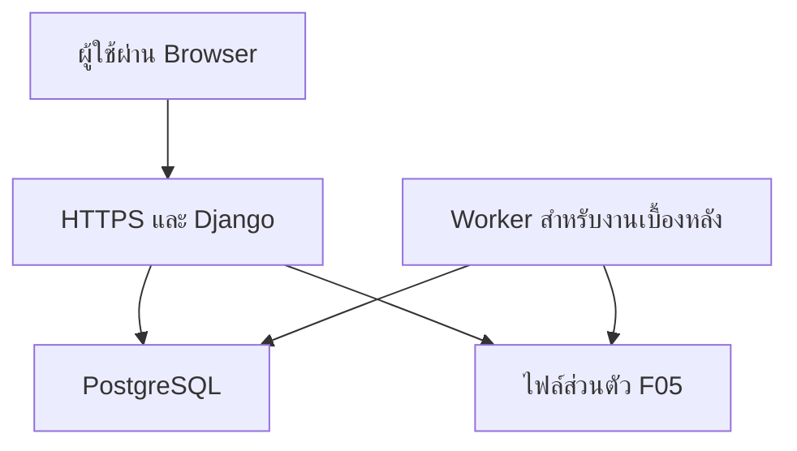

# ข้อกำหนดระบบดิจิทัลเก็บและรายงานผลลัพธ์ EdPEx

วิทยาลัยการศึกษา มหาวิทยาลัยพะเยา

System Blueprint 1.2 | ใช้เครื่องมือ EdPEx_6_Instruments.md ฉบับ 1.1 เป็นฐาน

ฉบับปรับปรุง: รองรับภาษาไทยและภาษาอังกฤษทั้งระบบ เพิ่มจากประวัติปี2565 หลังบ้าน ปฏิทิน แจ้งเตือน Dashboard3ระดับ และธีมชมพู–ม่วง–ทอง–ขาว ชื่อไฟล์คงเดิม แต่เลขรุ่นข้อกำหนดเป็น1.2 แยกจากเครื่องมือฐาน1.1 ข้อกำหนดนี้ยังไม่ใช่ชุดคำถามภาษาอังกฤษที่ผ่านการตรวจรับแล้ว

ข้อ 24–33 เป็นข้อกำหนดเพิ่มเติมบังคับสำหรับการพัฒนาครั้งนี้ อ่านร่วมกับข้อ 1–23 โดยข้อกำหนดใหม่มีลำดับเหนือข้อความเดิมในประเด็นเดียวกัน ไม่เลื่อนความสามารถเหล่านี้ไปเป็นงานนอกขอบเขต ข้อ33กำหนดการรองรับสองภาษาทุกระยะ

สถานะ: ข้อกำหนดสำหรับนำไปพัฒนาระบบและตรวจรับ ไม่ใช่ระบบที่สร้างหรือติดตั้งแล้ว ขนาดเครื่อง เวลา และเป้าหมายคุณภาพในเอกสารนี้เป็นข้อเสนอให้ทดสอบกับสภาพใช้งานจริง

## 1. ผลที่ต้องได้และขอบเขต

สร้างเว็บแอปสองภาษาไทย/อังกฤษ ใช้ภาษาไทยเป็นค่าเริ่มต้น สลับภาษาได้ในเว็บไซต์เดียวบนคอมพิวเตอร์ แท็บเล็ต และโทรศัพท์ ผู้ตอบกรอกข้อมูลตามบทบาท ผู้รับผิดชอบเห็นความครบถ้วน ระบบคำนวณ63ตัวชี้วัดจากข้อมูลต้นทาง และส่งออกผลที่รับรองไปใช้ในSARได้

เลือกใช้ responsive web application เป็นรุ่นแรก สามารถเพิ่มการติดตั้งไอคอนแบบ PWA ในระยะต่อไป ไม่จำเป็นต้องสร้างแอป iOS/Android แยกหรือระบบ microservices สำหรับขอบเขตเริ่มต้นนี้ เหตุผลเป็นการออกแบบเพื่อลดภาระดูแลและการทำข้อมูลซ้ำ มิใช่ข้อจำกัดทางเทคนิค

### ขอบเขตบังคับ

- F01 ประสบการณ์ผู้เรียนตาม C1/C2.1/C2.2/C3.1
- F02 ลูกค้า ผู้มีส่วนได้ส่วนเสีย และคู่ความร่วมมือตามบริบทคำเชิญ
- F03 ประสบการณ์และความผูกพันบุคลากร ST1/ST2 แบบไม่ระบุชื่อในคำตอบ
- F04 การบริหารและธรรมาภิบาล แยกผู้ถูกประเมิน ตำแหน่ง หลักสูตร และช่วงดำรงตำแหน่ง
- F05 ทะเบียนพัฒนาและอบรม มีหลักฐานและผู้ตรวจตามเดิม
- F06 ประเมินตนเองทุกส่วน ไม่มีผู้ประเมินให้คะแนน ไม่มีการทดสอบภาคปฏิบัติ ไม่มีการบังคับแนบหลักฐาน ตัวอย่างพฤติกรรมและแผนพัฒนาเลือกกรอก
- ทะเบียนตัวชี้วัด สูตรและรุ่น ประชากรและรอบ รายงานแยกกลุ่ม แนวโน้ม เป้าหมาย คู่เทียบ หลักฐานที่มาของผล และบันทึกปรับปรุง
- การนำเข้า ตรวจข้อมูล สิทธิ์ผู้ใช้ บันทึกการเปลี่ยนแปลง สำรอง/กู้คืน และส่งออก CSV/XLSX/หน้ารายงานพิมพ์เป็น PDF
- ประวัติผลตั้งแต่ปีรายงาน 2565 เป็นต้นไป ทั้งข้อมูลรายรายการและผลรวมเดิม พร้อมที่มาและวิธีวัดจริง
- หลังบ้านจัดการคำถาม เกณฑ์ประเมิน รุ่นแบบฟอร์ม ปฏิทินหลายฐานปี กำหนดส่ง ผู้รับผิดชอบ และแจ้งเตือน
- Dashboard สาธารณะ ผู้บริหาร และผู้ดูแลระบบ อัปเดตอัตโนมัติตามสิทธิ์และสถานะการเผยแพร่
- ออกแบบระบบตาม design tokens และเกณฑ์ UX ในข้อ 29 ใช้ชมพู ม่วง ทอง ขาว

### ยังไม่รวมในรุ่นแรก

แอป native, offline submission, AI ให้คะแนน/สร้างข้อมูลแทน, การเชื่อมทุกระบบมหาวิทยาลัย, ระบบร้องเรียนเฉพาะราย, ผลลัพธ์หมวด 7 ที่ไม่มีใน 63 รหัส, การประเมิน EdPEx 300 อัตโนมัติ การเพิ่มสิ่งเหล่านี้ต้องมีข้อกำหนดแยก

## 2. ลำดับเอกสารและข้อห้ามเปลี่ยนความหมาย

1. คำสั่งผู้ใช้ล่าสุด: เพิ่มประวัติปี2565 หลังบ้าน ปฏิทิน แจ้งเตือน Dashboard และธีมตามข้อ24–32 โดยยังคง F06 เป็นการประเมินตนเอง
2. EdPEx_6_Instruments.md รุ่น 1.1: แหล่งคำถาม ตัวเลือก การแสดงข้อ สูตร และข้อจำกัด
3. เอกสารนี้: ขยายรายละเอียดทางระบบและวิธีตรวจรับ โดยคงคำถามและสูตรของเครื่องมือฐาน1.1 ผู้ดูแลเพิ่ม/ลบ/แก้ในรุ่นถัดไปได้ผ่านขั้นตอน versioning ข้อ25
4. PDF ตัวชี้วัด: ชื่อและรหัสต้นฉบับ; เอกสารส่วนต้น: กลุ่มและ OP-3; เกณฑ์ EdPEx: กรอบผลลัพธ์; หนังสือเคล็ดลับ: แนวคิดประกอบ

หากพบข้อขัดแย้งให้บันทึกใน decision-log และแก้คำจำกัดความให้ชัดก่อนเปิดรอบจริง การเลือกสี รูปแบบเมนู หรือชื่อภายในโค้ดทำได้เองตามข้อกำหนด โดยไม่ต้องรอการตัดสินใจทุกจุด

ข้อคงที่:

- F06: assessment_method=self_report และ instrument_version ที่ใช้จริงเก็บในผลใหม่ทุกชุด รุ่นฐานคือ1.1; ผลประวัติเก็บวิธีวัดและรุ่นเดิมตามจริง ไม่เปลี่ยนย้อนหลังเป็น1.1
- 7.3-43 ต้องระบุว่าเป็นทักษะจากการประเมินตนเอง ไม่แสดงว่าเป็นผู้ผ่านการทดสอบ
- 7.4-3/4 ของ F06 เป็นการประเมินความเข้าใจด้วยตนเอง ขณะที่ K ของ F01/F02 ยังเป็นคำถามเลือกตอบตรวจความเข้าใจ
- ผล 7.4-6 ไม่ขึ้นกับการกรอกตัวอย่างพฤติกรรม
- การรับรองผลรวมหมายถึงตรวจสูตรและข้อมูลครบ ไม่ใช่รับรองสมรรถนะของผู้ตอบ
- ไม่เปลี่ยน NA หรือ missing เป็น 0; ไม่เติมเลขรหัสที่ข้าม; ไม่สร้างประวัติย้อนหลัง/คู่เทียบ/เป้าหมายขึ้นเอง
- มี 63 รหัสหลัก แต่ผลแยกกลุ่ม/ด้าน/ผู้ถูกประเมินมีมากกว่า 63 แถว

## 3. สถาปัตยกรรมที่เสนอ

ใช้ Django 5.2 LTS รุ่นแก้ไขความปลอดภัยที่ยังรองรับ ณ วันเริ่มโครงการ, Python รุ่นที่เข้ากันได้และยังได้รับการดูแล, PostgreSQL 17 รุ่นย่อยที่ได้รับการดูแล, HTML templates และ JavaScript เท่าที่จำเป็น ทุก dependency ต้องล็อกรุ่นหลังตรวจความเข้ากันได้ ไม่คัดลอกเลข patch จากเอกสารนี้โดยไม่ตรวจ

Django 5.2 เป็น LTS ตามข้อมูลผู้พัฒนา และมีตารางสถานะการสนับสนุนให้ใช้ตรวจรุ่นก่อนเริ่มและก่อนอัปเกรด: [Django download/support](https://www.djangoproject.com/download/) ส่วน PostgreSQL ให้เลือกรุ่นที่ยังอยู่ในช่วงสนับสนุนตาม [Versioning Policy](https://www.postgresql.org/support/versioning/)

| ส่วน | หน้าที่ | ข้อกำหนด |
|---|---|---|
| Browser | หน้ากรอกแบบประเมิน หน้าจัดการ และรายงาน | Responsive, Thai-first, keyboard accessible |
| HTTPS reverse proxy | TLS, routing, request limits | ตั้ง allowed host, ขนาด upload และ headers |
| Django application | สิทธิ์ กระบวนการ ฟอร์ม สูตร API และส่งออก | ระบบเดียว แยก module ตามโดเมน |
| PostgreSQL | ข้อมูลโครงสร้าง ธุรกรรม ประวัติ และผลรวม | constraints, migration, backups |
| Private object storage | เอกสารหลักฐาน F05 แหล่งอ้างอิงประวัติที่เจ้าหน้าที่นำเข้า และไฟล์ส่งออกชั่วคราว | private bucket, ตรวจสิทธิ์ก่อนดาวน์โหลด; ไม่บังคับแนบF06 |
| Worker | นำเข้า batch, ตรวจไฟล์, คำนวณและส่งออกขนาดใหญ่ | ใช้ตาราง job ในฐานข้อมูลและ worker process เริ่มต้นได้ ไม่จำเป็นต้องเพิ่ม message broker |



UI กับระบบคำนวณต้องเรียก business services ชุดเดียว ห้ามคำนวณตัวชี้วัดหลักเฉพาะใน browser แล้วเชื่อค่าที่ client ส่งมา ฐานข้อมูลและที่เก็บหลักฐานไม่เปิด public

ตัวเลือกการติดตั้งหลักคือโครงสร้างพื้นฐานที่มหาวิทยาลัยดูแลและมีผู้รับผิดชอบชัดเจน หากยังไม่มีให้ใช้บริการ managed ที่องค์กรอนุมัติ โดยประเมินทั้งฐานข้อมูล ที่เก็บไฟล์ สำรองข้อมูล และการเข้าถึงของผู้ดูแล ไม่ระบุราคาในขั้นนี้เพราะยังไม่ทราบปริมาณและผู้ให้บริการ

## 4. บทบาทและสิทธิ์

สิทธิ์ใช้ RBAC ร่วมกับขอบเขตองค์กร/รอบ/บุคคล ตรวจฝั่ง server ทุก request รวมรายการ API ส่งออก ดาวน์โหลด และ background job การซ่อนปุ่มอย่างเดียวไม่ถือว่าเพียงพอ

| บทบาท | ทำได้ | เข้าถึงข้อมูล |
|---|---|---|
| Respondent-external | ตอบ F01/F02/F04 ตามสิทธิ์คำเชิญ | เฉพาะคำตอบระหว่าง session ของตน |
| Staff | F05 ของตน, F06 ของตน, ใช้คำเชิญ F03/F04 แยก | ประวัติรายบุคคลของตน; ไม่เห็นคำตอบผู้อื่น |
| Round coordinator | สร้างรอบ/กรอบเชิญ ติดตามจำนวนใช้สิทธิ์ | ไม่เห็นความเชื่อมโยงตัวผู้ตอบกับความคิดเห็น |
| HR data officer | จัดการทะเบียนบุคลากร ตรวจ F05 | หลักฐานอบรมตามหน้าที่; F06 เห็นสถานะ/ข้อมูลตามขอบเขตที่อนุมัติ ไม่แก้คะแนนแทน |
| Privacy/data steward | ตรวจคุณภาพข้อความ ปกปิดตัวระบุ สรุปข้อมูลอ่อนไหว | คำตอบ F01–F04 ที่ไม่มีตัวระบุและไม่มีตารางเชื่อมตัวบุคคล |
| Result analyst | คำนวณและจัดทำข้อเสนอผลรายงาน | ผลรวม; ข้อมูลที่ได้รับอนุญาตตามขอบเขต ไม่ใช้ตัวกรองเจาะกลุ่มเล็ก |
| Result approver | รับรองหรือส่งกลับผลรวมพร้อมเหตุผล | สูตร การตรวจคุณภาพ ผลรวมที่แสดงได้; ไม่ให้คะแนน F06 รายบุคคล |
| Public visitor | ดู Dashboard สาธารณะโดยไม่เข้าสู่ระบบ | เฉพาะชุดผลที่อนุมัติให้เผยแพร่สาธารณะ |
| Executive | Dashboard ผู้บริหาร ผลรับรอง แผนปรับปรุง และความคืบหน้าที่เปิดได้ | ผลรวมตามกติกาการเปิดเผย; provisional เฉพาะข้อมูลไม่อ่อนไหวที่ policy อนุญาต |
| System administrator | บัญชี บทบาท หลังบ้านคำถาม/เกณฑ์/รอบ/แจ้งเตือนและปฏิบัติการ | ไม่มีสิทธิ์อ่าน raw survey หรือเผยแพร่ผลเป็นค่าเริ่มต้นผ่าน UI |

คนหนึ่งอาจมีหลายบทบาทได้ แต่ต้องบันทึกและทบทวนสิทธิ์ สำหรับผลที่จะใช้ใน SAR ให้ผู้รับรองเป็นคนละคนกับผู้จัดทำผลถ้าจัดบุคลากรได้ บัญชีฐานข้อมูล/เครื่องแม่ข่ายมีอำนาจทางเทคนิคสูง จึงไม่อ้างว่าระบบป้องกันผู้ดูแลโครงสร้างพื้นฐานได้โดยสิ้นเชิง ใช้สิทธิ์น้อยที่สุด การบันทึกการใช้งาน และการกำกับขององค์กรร่วมกัน

เข้าสู่ระบบบุคลากรผ่าน SSO ของมหาวิทยาลัยเมื่อมีข้อมูลการเชื่อมต่อที่ถูกต้อง ใช้ OIDC/SAML ผ่านไลบรารีที่ดูแลอยู่ ไม่เขียนระบบพิสูจน์ตัวตนเอง ผู้ใช้ต้นแบบใช้บัญชีท้องถิ่นใน staging ได้ บัญชี privileged ใน production ต้องมี MFA ผ่าน IdP หรือวิธีที่ได้รับอนุมัติ

## 5. เมนูและหน้าจอ

| หน้า | เนื้อหา/การกระทำหลัก | สถานะที่ต้องรองรับ |
|---|---|---|
| งานของฉัน | งาน F05/F06 และกำหนดส่ง | ยังไม่เริ่ม/ร่าง/ส่งแล้ว/ข้อมูลไม่ครบ |
| ตอบแบบสำรวจ | คำชี้แจง บริบท คำถามตามกลุ่ม บันทึก/ส่ง | token ไม่ถูกต้อง/หมดอายุ/ใช้แล้ว/ปิดรอบ/เน็ตขัดข้อง |
| ทะเบียนกลาง | กลุ่ม หลักสูตร บุคลากร ตำแหน่ง ภารกิจ หน่วยงานคู่ความร่วมมือ | active/inactive และวันที่มีผล |
| เครื่องมือและตัวชี้วัด | รุ่นคำถาม/มาตรา/สูตร/63 รหัส/preview กลุ่ม | draft/published/retired |
| รอบเก็บข้อมูล | วันเวลา ขอบเขตประชากร หน่วยนับ คำเชิญ ความคืบหน้า | ตาม workflow ข้อ 7 |
| พัฒนาบุคลากร | กิจกรรม ผู้เข้าร่วม ชั่วโมง หลักฐาน การตรวจ F05 | ร่าง/ส่งตรวจ/ขอแก้ไข/ตรวจรับ/ไม่รับ |
| ประเมินตนเอง | F06 A/B/C/D และแผนพัฒนาเลือกกรอก | ไม่มีปุ่มส่งผู้ประเมินหรือแนบหลักฐาน |
| คุณภาพข้อมูล | ซ้ำ ชั่วโมงผิดปกติ mapping ขาด ข้อมูลไม่ครบ | แก้ไข/มีคำชี้แจง/ใช้ไม่ได้ |
| ผลลัพธ์ | 7.2/7.3/7.4 แยกตัวชี้วัดและ series | draft/approved/superseded/suppressed/no data |
| แผนปรับปรุง | ประเด็น ผู้รับผิดชอบ กำหนด ผลวัดซ้ำ | open/in progress/completed/verified outcome |
| ผู้ดูแล | สิทธิ์ บันทึกเหตุการณ์ สำรอง สถานะงาน | ไม่มีข้อมูลลับใน error screen |

หนึ่งหน้ากรอกแบ่งส่วนสั้น ๆ มี “ก่อนหน้า/ถัดไป” และสรุปก่อนส่ง จอเล็กใช้การ์ดคำถาม ไม่บังคับเลื่อนตารางแนวนอนเพื่อเลือกคะแนน ใช้ตัวหนังสือบอกสถานะ ไม่พึ่งสีเพียงอย่างเดียว

## 6. กติกาฟอร์มและ validation

### กติกากลาง

- มี stable question_id + instrument_version เช่น F06-K03/1.1 ไม่ใช้ K03 เปล่า ๆ เพราะต่างจาก F01-K03
- answer types: integer_scale, single_choice, multi_choice, text, date, decimal, context_reference
- ช่องคำตอบแบบแยกสถานะ: answered, skipped, not_applicable, unable_to_assess, not_shown ค่าคำตอบ “ไม่ทราบ” ของ K เป็น answered option U ซึ่งถูกคิดเป็นผิด ไม่ใช่ unable_to_assess
- กรณีไม่แสดงคำถามเพราะ branch ไม่เกี่ยวข้องใช้ not_shown และไม่นับในจำนวน missing
- server ตรวจ membership ของตัวเลือก ช่วงคะแนน เงื่อนไข branch และบริบททุกครั้ง ปฏิเสธคะแนน 6, ข้อมูลของกลุ่มอื่น, คะแนนทดสอบภาคปฏิบัติใน F06
- ถ้าเปลี่ยนคำตอบแม่จนข้อย่อยถูกซ่อน ให้ตัดคำตอบลูกจาก current submission และการคำนวณ ไม่ปล่อยค่าซ่อนค้าง
- ข้อมูลกลุ่มหลัก/รอบ/บริบทเป็น required คำถามความคิดเห็นที่อนุญาตข้ามในต้นแบบยังข้ามได้ ไม่เปลี่ยนเป็นบังคับทั้งหมด
- ข้อความทั่วไปไม่เกิน 500 ตัวอักษรตามต้นแบบ; ฟิลด์ที่ยังไม่ได้ระบุให้ตั้งเพดานและอธิบายก่อนใช้ ห้าม render HTML ที่ผู้ตอบส่งมา
- บันทึกเวลาฝั่ง server ใช้ UTC และแสดง Asia/Bangkok; วันเกิดเหตุ/อบรมเก็บ date ตามพื้นที่ แสดง พ.ศ. ได้แต่ฐานข้อมูลใช้ ISO ค.ศ.

### เงื่อนไขเฉพาะ

| ชุด | เงื่อนไข |
|---|---|
| F01 | กลุ่มกำหนดจากสิทธิ์คำเชิญและ/หรือบริบทที่ตรวจได้ C1/C2.1 ใช้ชุดเต็ม; C2.2/C3.1 ชุดย่อ; ไม่เปิด C3.2 |
| F02 | หนึ่งคำตอบต่อบทบาทและหน่วยนับในรอบ ห้ามหลายบทบาทในคำตอบเดียว; หน่วยงาน/ชุมชนไม่ปนคน |
| F03 | G08 เลือกไม่เกิน 3; H01 รับ 0–10 รวม 0 เป็นคะแนนจริง |
| F04 | ผู้ถูกประเมินถูกตรึงจากคำเชิญ P03=ไม่มีข้อมูลเพียงพอ ให้จบแบบด้วยสถานะประเมินไม่ได้ ไม่บังคับคะแนน |
| F05 | ชั่วโมงจริงไม่ติดลบ ช่วงเวลาไม่ย้อนกลับ ไม่ซ้ำคน–กิจกรรม–session ต้องตรวจรับก่อนคำนวณ |
| F06 | A01–05 ST1, A01–09 ST2; B เลือกไม่เกี่ยวข้องได้พร้อมเหตุผล; C/D เป็นคะแนนตนเอง; ตัวอย่างและแผนพัฒนาไม่บังคับ |

F06 ห้ามมี assessor_score, reviewer approval, evidence upload หรือ verified competence ในหน้าจอ/API/ผลรายงาน การตรวจ F05 ยังคงเดิม อย่าใช้ workflow ร่วมกันจน F06 ต้องรออนุมัติ

## 7. Workflow และการล็อกรุ่น

### เครื่องมือ

draft → published → retired เมื่อ published แล้วห้ามแก้คำถาม ตัวเลือก หรือสูตรในรุ่นเดิม ให้ clone เป็นรุ่นใหม่ รวมการแก้คำผิดตามกติกาข้อ25 เพื่อรักษาข้อความที่ผู้ตอบเห็นจริง

### รอบ

draft → ready → open → closed → calculating → review → approved → archived

- ready ต้องมี version, กลุ่ม, ประชากร/หน่วยนับ, วันเวลา, เจ้าของ, คำชี้แจงข้อมูลและสูตรครบ
- open รับคำตอบและ F06 revisions ภายในช่วงเวลาเท่านั้น
- closed หยุดรับคำตอบ; calculating สร้าง snapshot จาก revision ที่ระบุ
- review ส่งกลับไปคำนวณใหม่ได้เมื่อแก้ข้อมูลโดยผู้มีสิทธิ์และบันทึกเหตุผล
- approved ล็อกผลทั้งหมดใน calculation run นั้น เปลี่ยน source แล้วต้องออกผลฉบับใหม่ ไม่ทับค่าเดิม
- reopen เป็นการกระทำพิเศษจาก closed/review พร้อมเหตุผลและเวลาปิดใหม่ ผลที่เคยรับรองแล้วต้องเก็บไว้เป็นเวอร์ชันเก่า ไม่เผยแพร่ฉบับใหม่จนตรวจเสร็จ
- รอบ approved จะออก correction run ได้ แต่ไม่ปลดล็อกผลเก่า; สิ่งที่ผู้บริหารเห็นคือฉบับรับรองล่าสุดพร้อมประวัติ

### คำตอบ

F01–F04: ร่างใน anonymous session → ส่งแล้ว (complete หรือ partial) → read-only หนึ่งสิทธิ์ใช้ได้ครั้งเดียว รุ่นแรกไม่รองรับตามแก้คำตอบหลังส่ง เพื่อไม่เพิ่มการเชื่อมตัวบุคคลกับคำตอบ

F06: draft → submitted (complete/partial เป็นฟิลด์แยก) → revised submission ได้ก่อนปิดรอบ ใช้ latest submitted revision ณ cutoff ไม่ใช้ highest score; ไม่มี reviewer step

F05: draft → submitted → verified หรือ needs_correction/rejected ผู้ตรวจระบุเหตุผล มี revision เมื่อส่งแก้

ข้อมูลขาดในบางข้อไม่ทำให้คำตอบที่สมบูรณ์ของข้ออื่นสูญหาย จำนวนที่ใช้คำนวณต้องเป็นรายตัวชี้วัด ไม่ใช้จำนวนคนที่กดส่งเท่ากันทุกสูตร

## 8. คำเชิญและการปกปิดตัวผู้ตอบ

ระบบรุ่นแรกใช้คำเชิญแบบควบคุมกรอบประชากร F01–F04 แทนลิงก์เปิดทั่วไป รหัสเชิญมีความสุ่มเพียงพอ จัดเก็บ hash และหมดอายุ/เพิกถอนได้ ผู้รับผิดชอบดาวน์โหลดรายชื่อ/ลิงก์เพื่อส่งผ่านช่องทางที่องค์กรเลือก ไม่ส่งอีเมล/SMS อัตโนมัติจนตั้งค่าบริการและอนุมัติเนื้อหาแล้ว

แยกอย่างน้อยสองขอบเขตข้อมูล:

1. Invitation registry: ผู้ได้รับเชิญ/หน่วยนับ/กลุ่ม/บริบท/hash token/สถานะใช้สิทธิ์ ไม่มี response_id
2. Survey response store: random response_id/round/group/context/คำตอบ ไม่มี user_id, staff_id, invitation_id, token hash หรือ contact

ขั้นตอนส่ง:

1. ตรวจ token และ eligibility ฝั่ง server
2. เปิด session แบบแยกจากบัญชีบุคลากร ไม่คัดลอก user_id ไปยังคำตอบความคิดเห็น
3. เมื่อส่ง ตรวจ branch และค่าคำตอบให้ครบตามกติกา
4. ภายใน database transaction เดียว lock invitation row, ตรวจยังไม่ใช้, mark spent และ insert response แบบไม่มี FK เชื่อม invitation
5. concurrent submit เดียวกันต้องสร้าง response เพียงหนึ่งรายการ ถ้าทำธุรกรรมไม่สำเร็จต้อง rollback ทั้งคู่
6. ตอบกลับ receipt แบบสุ่ม ไม่เผยคะแนน/เฉลย K ให้บุคคลภายนอกก่อนปิดรอบ

การส่งซ้ำหลัง network timeout: ระบบแจ้งว่ารหัสนี้ถูกใช้ส่งแล้ว โดยไม่สร้างคำตอบใหม่ สำหรับ F01–F04 ไม่ให้ endpoint ที่ใช้ token ดึงคำตอบที่ส่งแล้ว ไม่มี token → response lookup สำหรับฝ่ายงาน

ไม่บันทึก token ใน URL access logs, analytics, error tracking หรือ referrer; token exchange ควรใช้ fragment + POST แลก session หรือกลไกเทียบเท่าที่ไม่หลุดใน log; ใช้ Referrer-Policy และตัดข้อมูลลับก่อน log Cookie Secure/HttpOnly/SameSite ใช้ session ที่แยกจาก staff portal หาก browser เดียวกัน

session ฝั่ง server มีข้อมูลชั่วคราวระหว่างตอบและต้องล้างเมื่อส่ง/หมดอายุ ร่างไม่เก็บใน localStorage ถาวรบนเครื่องสาธารณะ ไม่มี raw timestamps รายบุคคลใน dashboard ฝ่ายงาน อาจมี log เชิงเทคนิคที่ใช้เชื่อมบริบทได้สำหรับผู้ดูแลระดับสูง จึงเรียกระบบนี้ว่า “ไม่ระบุชื่อในข้อมูลคำตอบและจำกัดการเชื่อมโยง” ไม่รับรองว่าไม่มีทางระบุตัวได้ทุกกรณี

รหัสสูญหายก่อนใช้: เพิกถอนเดิมและออกใหม่ในหน่วยสิทธิ์เดิมได้ หลังใช้แล้วไม่ออกสิทธิ์ใหม่เอง การแก้ข้อผิดพลาดหลังส่งของแบบไม่ระบุตัวให้ใช้แนวทางระดับรอบและบันทึกข้อจำกัด ไม่ค้นคืนคะแนนด้วยตัวบุคคล

## 9. โครงสร้างฐานข้อมูล

ใช้ UUID primary keys, timestamps, organization_id ที่ข้อมูลธุรกิจ และ FK/unique constraints ตามที่ระบุ UUID ไม่ใช่ตัวแทนการตรวจสิทธิ์ สามารถเริ่มใช้หนึ่งองค์กรได้แต่ต้องไม่เขียน query ที่ข้ามขอบเขตโดยไม่ตรวจ

| ตาราง/กลุ่มตาราง | ฟิลด์หลักและความสัมพันธ์ | ข้อกำหนด |
|---|---|---|
| organizations | id, name, timezone | องค์กรเริ่มต้นหนึ่งแห่ง |
| users, role_assignments | user, role, scope, active_from/to | ไม่เก็บสิทธิ์ใน client อย่างเดียว |
| respondent_groups | code, parent_code, label, active | C2.1 อยู่ใต้ C2; S3-1 ใต้ S3 |
| programmes, partner_orgs | code, name, group/context | ไม่สร้างชื่อหลักสูตรหรือรายชื่อบุคคลสมมติเป็นข้อมูลจริง |
| people, employments | person, staff_code, employment_start/end, ST type | อยู่ identity domain ไม่ FK จาก survey answers |
| positions, appointments | position, person, start/end, responsibility, programme | รองรับตำแหน่งเปลี่ยนและหลายหลักสูตร |
| instruments, instrument_versions | F01–F06, version, status, checksum | version immutable หลัง publish |
| questions | version_id, question_id, text, type, required_rule, visibility_rule | unique(version,question_id) |
| question_options, translations | question, stable option code, label/language | เฉลย K อยู่ server-only ไม่อยู่ public schema |
| indicators | code, original_name, display_name, unit, direction, owner | unique(org,code), 63 รหัสเริ่มต้น |
| formula_versions | key, version, parameters, source/commit hash | allowlisted functions ไม่มี eval ข้อความจาก admin |
| indicator_bindings | indicator, formula_version, question_ids, group_rule, dimension | หนึ่งข้อรองรับหลายรหัสและกลุ่มได้ |
| collection_rounds | date_start/end, calendar_type, cutoff, status, owner | สถานะเปลี่ยนผ่าน service เดียว |
| round_instruments | round, instrument_version, context, configuration | unique ขอบเขตที่ไม่กำกวม |
| population_snapshots | round, definition, count_by_group, captured_at | immutable เมื่อเปิด เก็บ version ถ้าแก้ |
| population_members | snapshot, eligible_unit_id, group, employment facts | restricted identity data |
| invitations | round_instrument, eligible_unit, token_hash, spent, expires | unique หน่วยสิทธิ์ในบริบท ไม่มี response FK |
| survey_responses | round_instrument, group, context, random id, completion | ไม่มีข้อมูลระบุตัวหรือ token |
| survey_answers | response, question, typed_value, status | unique(response,question) |
| self_assessments | person, round, version, submitted_at, revision | latest submitted selection ที่ cutoff |
| self_answers | assessment_revision, question, score/status, optional_text | ไม่มี assessor/evidence columns |
| applicability | person/round/dimension, declared_status, reason | B ไม่เกี่ยวข้องต้องมีเหตุผล ไม่ต้องอนุมัติ |
| expected_levels | role/dimension/round, level | freeze ก่อนรอบ ไม่แก้ลดให้ผ่านย้อนหลัง |
| development_activities | organizer, dates, type, category tags | F05 กิจกรรมไม่ซ้ำตาม key ที่กำหนด |
| development_attendance | activity, person, session, training_hours, visit_hours, status | unique(activity,person,session), decimal ≥0 |
| evidence_files | storage_key, mime, size, sha256, scan_status, owner | ใช้ F05 เท่านั้น; private download |
| attendance_reviews | attendance_revision, reviewer, decision, reason | audit เมื่อแก้/รับ/ไม่รับ |
| calculation_runs | round, cutoff, source_revision_manifest, formula_versions, engine_commit, status | reproduce ผลเก่าได้ |
| indicator_results | run, indicator, group, context, dimension, values, source_counts, status | unique(run,indicator,series_key) |
| result_approvals | run, approver, action, reason, at | ไม่อนุมัติคำตอบรายบุคคล F06 |
| targets, comparators | indicator/series, value, period, definition, source, comparability_note | ไม่มีค่าเริ่มต้นปลอม |
| improvement_actions | result, issue, action, owner, due, followup | ผูกผลกับการปรับปรุง |
| audit_events | actor/action/object/reason/request_id/at | redact answer text, tokens, secrets |
| import_batches, jobs, export_files | owner, scope, hash, progress, result, expiry | idempotent retries, file TTL |

ดัชนีเริ่มต้น: round/status, response(question+round ผ่าน FK), person+round, attendance(person+date), result(indicator+series+period), job(status+created) ตรวจ query plan เมื่อโหลดเพิ่ม ไม่เพิ่ม index ทุกคอลัมน์โดยไม่มีเหตุผล

ไม่เก็บทั้ง survey_answers และ self_answers ซ้ำสำหรับ F06 ให้ใช้ self_answers เป็นแหล่งจริงและ adapter สำหรับสูตร การเก็บผลรวมเป็น snapshot ได้แต่ต้องชี้ต้นทางและวิธีคำนวณได้

## 10. ทะเบียน 63 ตัวชี้วัดและกลุ่ม

ให้ Codex สร้างไฟล์ catalog แบบ JSON/YAML จากเอกสารเครื่องมือ 1.1 โดยคงรหัสและข้อความ ไม่ให้โปรแกรมเดาความหมายจากเลขข้ออย่างเดียว

รหัสหลักที่ต้องมีตรงชุดนี้:

```text
7.2-1 7.2-2 7.2-3 7.2-4 7.2-5 7.2-6 7.2-7 7.2-8 7.2-9 7.2-10
7.2-11 7.2-12 7.2-13 7.2-14 7.2-15 7.2-17 7.2-18 7.2-19 7.2-20
7.2-24 7.2-25 7.2-34 7.2-35 7.2-36
7.3-25 7.3-26 7.3-27 7.3-28 7.3-29 7.3-36 7.3-37 7.3-38 7.3-39
7.3-43 7.3-44 7.3-45 7.3-46 7.3-47 7.3-48 7.3-49 7.3-50 7.3-51
7.3-52 7.3-53 7.3-54 7.3-55
7.4-1 7.4-2 7.4-3 7.4-4 7.4-6 7.4-7 7.4-8 7.4-9 7.4-10
7.4-11 7.4-12 7.4-13 7.4-14 7.4-15 7.4-18A 7.4-18B 7.4-18C
```

24 รหัสหมวด 7.2 + 22 รหัสหมวด 7.3 + 17 รหัสหมวด 7.4 = 63 ห้ามแทนด้วยผลจำนวนข้อคำถาม

| ขอบเขต | รหัส/การแยกผล |
|---|---|
| C1,C2.1 | 7.2-1–10,14,15,24,25 |
| C2.2,C3.1 | 7.2-11,12,36 |
| ผู้เรียนทุกกลุ่มที่ระบุ | 7.4-7,8 |
| C4.1,C5.1,C5.2,C5.3 | 7.2-17,18,35;7.4-9,10 แยกกลุ่มและหน่วยนับ |
| C5.3 | 7.2-13 เพิ่มเติมจาก S01 เดียวกับ 17 ภายใต้นิยามเดียวกัน |
| S1,S3-1,S3-2,CO-1–4 | 7.2-19,20,34;7.4-11,12 |
| ST1,ST2 | ผล F03/F05/F06 แยกประเภทตาม mapping ต้นแบบ |
| ST1 | 7.3-50 เฉพาะ A01–05 |
| ST2 | 7.3-51 เฉพาะ A01–09 |
| ผู้บริหาร/กรรมการ/ประธานหลักสูตร | 7.4-13,14,15,18A–C แยกผู้ถูกประเมินและบริบท |

รายละเอียดทุก question binding ให้อ้างตารางความครอบคลุมในเครื่องมือ 1.1 และสร้าง mapping report ตรวจได้ว่ารหัสใดใช้คำถามใด สูตรใด กลุ่มใด ไม่อาศัยเพียง count=63 แล้วถือว่าครบ

## 11. Calculation engine

สร้างฟังก์ชันบริสุทธิ์ที่รับ typed answers + frozen population + config แล้วคืน value/status/counts ใช้ Decimal หรือวิธีที่หลีกเลี่ยงความคลาดเคลื่อนการปัด ปัดเพียงตอนแสดงผล 2 ตำแหน่ง เปรียบเทียบเกณฑ์จากค่าจริงก่อนปัด

| Formula key | รหัสที่ใช้/หลักการ |
|---|---|
| SAT_TOP2 | S/C ที่เป็นร้อยละ: คะแนน 4–5 / คะแนน 1–5 ×100 |
| DIS_YES | D: Y/(Y+N)×100 โดย NA/missing/not_shown ไม่ใช่ N |
| MEAN_5 | การแนะนำ 7.2-25/34/35/36 และ 7.4-2: ค่าเฉลี่ยคะแนนเต็ม 5 |
| ENG_3 | 7.2-24,7.3-37: E ครบสามข้อและ mean≥4 / ผู้ตอบครบสาม ×100 |
| PAIR_MEAN_TOP | 7.3-36: S05/S06 ครบและ mean≥4 / ผู้ตอบครบคู่ ×100 |
| HAPPINESS_10 | 7.3-38: mean H01 รวมคะแนน 0 เป็นค่าจริง |
| DIMENSION_SAT | 7.3-39: G01–G07 แยก ไม่ใช้ G08 ในคะแนน |
| ADMIN_MEAN | 7.4-13/14/18A–C: อย่างน้อย 4/5 ข้อ เฉลี่ยรายคนก่อนเฉลี่ยคน |
| ETHICS_TOP | 7.4-15: ET ครบสี่ mean≥4 / ผู้ตอบครบสี่ ×100 |
| K_EXTERNAL | 7.4-8/10/12: K00=เคย, K01–02 ถูกทั้งหมด, K03–06 ถูก≥3; หารผู้ตอบ K00–06 ครบ |
| SELF_VISION | 7.4-3: F06-K01–02 ครบ ทุกข้อ≥4 / ผู้ตอบครบคู่ ×100 |
| SELF_VALUES | 7.4-4: F06-K03–06 ครบ ทุกข้อ≥4 / ผู้ตอบครบสี่ ×100 |
| SELF_BEHAVIOUR | 7.4-6: รายค่านิยม FREQ 4–5/ผู้ตอบคะแนน; รวมต้องตอบสี่ครบและผ่านทุกข้อ |
| SELF_COMPETENCY | 7.3-50/51: ST1 ครบห้า/ST2 ครบเก้า เฉลี่ยคนก่อนเฉลี่ยคน |
| SELF_DIMENSION | 7.3-54/55: ค่าเฉลี่ยราย M/SO ของผู้ที่เกี่ยวข้องและมีคะแนน ไม่รวมคน NA และแสดงจำนวนแต่ละสถานะ |
| SELF_DIGITAL_POP | 7.3-43: ตอบครบ D01–05 ทุกข้อ≥3 / ประชากรต้องประเมินทั้งหมด ×100 |
| TRAINING_HOURS | 7.3-44: ชั่วโมงอบรมจริงที่ตรวจรับ ไม่ซ้ำ / ประชากรบุคลากรทั้งหมด |
| TRAINING_PEOPLE | 7.3-45/46/48: คนไม่ซ้ำที่อบรมหมวดนั้น >0 ชม. / ประชากร ×100 |
| SAFETY_ANY | 7.3-47: คนไม่ซ้ำอบรมอย่างน้อยหนึ่งด้าน S/H/E / ประชากร ×100 พร้อมแยกสามด้าน |
| STUDY_VISIT | 7.3-49: คนไม่ซ้ำที่ดูงานภายนอกตามหลักฐานตรวจรับ / ประชากร ×100 |

SELF_DIGITAL_POP คนไม่ตอบ/ยังประเมินไม่ได้อยู่ในตัวหารเพราะเป็นสูตรต่อประชากร ส่วนสูตรความเข้าใจ F06 หารเฉพาะผู้ตอบคะแนนครบ ต้องไม่ใช้ตัวหารแบบเดียวกันทั้งระบบ

7.3-44 ไม่รวมชั่วโมงดูงานล้วน รายการอบรมหลายหมวดนับชั่วโมงเดียว คนอบรมซ้ำหมวดเดิมนับคนเดียวใน TRAINING_PEOPLE เก็บป้ายหมวดแยกจาก attendance เพื่อไม่ให้ JOIN ทำยอดคูณซ้ำ

ค่าตอบกลับมาตรฐาน:

```json
{
  "indicator_code": "7.3-43",
  "method": "self_report",
  "instrument_version": "1.1",
  "formula_key": "SELF_DIGITAL_POP",
  "formula_version": "1.1",
  "status": "computed",
  "value": "50.00",
  "numerator": "2",
  "denominator": "4",
  "unit": "percent",
  "counts": {"eligible": 4, "complete": 3, "submitted_partial": 0, "not_submitted": 1},
  "note": "ข้อมูลตัวอย่างสำหรับทดสอบ ไม่ใช่ผลจริง"
}
```

สถานะผล: computed, no_valid_data, not_applicable, insufficient_population_definition, suppressed, calculation_error ไม่มีผลหรือคำนวณผิดไม่ควรแทนด้วย 0 ใช้ผล no_valid_data เมื่อ denominator=0 และไม่หารศูนย์

series_key รวม indicator + group + unit + context/dimension + period_type + method/version เมื่อรวมกลุ่มต้องเช็คสูตร ช่วงเวลา นิยามและหน่วยเหมือนกันก่อน รวม n/N ไม่เฉลี่ยร้อยละเปล่า คะแนนเฉลี่ยใช้ sum/count ที่ถูกระดับ เช่นรายคนที่ตอบครบ

### การทำซ้ำผลเก่า

Calculation run เก็บ cutoff, รายการ source revision IDs หรือ manifest ที่ตรวจสอบได้, population snapshot, question/formula hashes และ engine commit ผลรับรองอ่าน snapshot ห้ามคำนวณสดจนค่ารายงานเก่าเปลี่ยนเมื่อข้อมูลใหม่เข้ามา

## 12. ตัวอย่างชุดทดสอบสูตรที่ต้องผ่าน

ค่าด้านล่างเป็นข้อมูลจำลองสำหรับ automated tests เท่านั้น ไม่ใช้ในฐานข้อมูลจริง

| Test ID | ข้อมูลเข้า | ผลที่ต้องได้ |
|---|---|---|
| CAL-01 | SAT=[5,4,3,NA,missing] | 2/3=66.67%; valid_n=3; NA=1; missing=1 |
| CAL-02 | DIS=[Y,N,N,NA,missing] | 1/3=33.33% ไม่ใช่ 100−SAT |
| CAL-03 | ENG คน A=[5,4,3], B=[4,4,missing], C=[3,3,3] | A ผ่าน,C ไม่ผ่าน,B ไม่เป็นตัวหาร;1/2=50% |
| CAL-04 | 7.3-36 A=[5,3],B=[5,NA],C=[3,3] | A ผ่าน,C ไม่ผ่าน,B ตัด;50% |
| CAL-05 | F04 A=[5,5,5,5,NA], B=[3,3,3,3,3], C=[5,5,NA,NA,NA] | meanรายคน A=5,B=3,Cไม่เข้า;ผล=4.00 ไม่ใช่เฉลี่ยคำตอบ 35/9 |
| CAL-06 | F06 D: A=[3,3,3,3,3],B=[5,5,2,5,5],C=[4,4,4,4,4],D ไม่ส่ง;ประชากร4 | 2/4=50%; complete=3;ต่ำกว่าเกณฑ์ตนเอง1;ไม่ส่ง1 |
| CAL-07 | F06 K วิสัยทัศน์ A=[5,3],B=[4,4],C=[4,missing] | 1/2=50% ไม่ใช้ค่าเฉลี่ย≥4 และไม่ใช้เฉลยเลือกตอบ |
| CAL-08 | F06 SEUP A=[4,4,4,4] ไม่มีตัวอย่าง B=[5,5,5,3] มีตัวอย่าง | ภาพรวม1/2=50%;Aไม่เสียคะแนนเพราะไม่กรอกตัวอย่าง |
| CAL-09 | K_EXTERNAL A=เคย,ถูก2/2และ3/4;B=ไม่เคย,ถูกทั้งหมด;C=เคยแต่ K หนึ่งข้อว่าง | 1/2=50%; C ไม่เข้า denominator |
| CAL-10 | H01=[0,10,missing] | mean=5.00 ไม่ตัดศูนย์ |
| CAL-11 | ประชากร4 คน; A อบรม3ชม.ติด T45/T46;B อบรม2ชม.T46;อีกสองคน0 | 7.3-44=5/4=1.25ชม.;45=25%;46=50% |
| CAL-12 | คน A อบรม S และ H, B อบรม E;ประชากร4 | 47=2/4=50% ไม่ใช่3/4;รายด้านแต่ละด้าน25% |
| CAL-13 | ค่า SAT กลุ่มหนึ่ง1/1 อีกกลุ่ม1/9 | รวม2/10=20% ไม่ใช่55.56% |
| CAL-14 | ทุกคำตอบ NA และไม่มีคะแนน valid | status=no_valid_data,value=null |
| CAL-15 | F06 revisions:ร่างคะแนน5;ส่งครั้ง1คะแนน4;ส่งครั้ง2คะแนน3ภายใน cutoff | ใช้ครั้ง2คะแนน3 ไม่ใช้ร่างหรือสูงสุด |
| CAL-16 | C5.3 คำตอบ S01หนึ่งชุดผูก13และ17 | ผลสองรหัสเท่ากัน แต่จำนวนคนรายกลุ่มไม่เพิ่มเป็นสองเท่า |
| CAL-17 | M01 A=4,B=ไม่เกี่ยวข้องพร้อมเหตุผล,C=missing | mean4.00;valid1;NA1;missing1 ไม่ใช่1.33 |
| CAL-18 | ชั่วโมงดูงานล้วน8ชม. อบรม0 ประชากร4 และผู้ร่วม1 | 44=0.00ชม.;49=25% |

เพิ่ม property tests สำหรับ no double counting, ค่าร้อยละอยู่ 0–100, valid ≤ eligible เมื่อกรอบนิยามตรง, results immutable, idempotent run เมื่อ source ไม่เปลี่ยน

## 13. รายงานและการป้องกันผลกลุ่มเล็ก

หน้าตัวชี้วัดแสดงชื่อ หน่วย ผลล่าสุด เป้าหมาย n/N ความครอบคลุม วิธีวัด รุ่น ช่วงเวลา ข้อมูลเปรียบเทียบที่มีแหล่ง และแนวโน้มจริง แสดง “ยังไม่กำหนดเป้าหมาย” และ “ยังไม่มีข้อมูลคู่เทียบ” ได้ตามจริง

หน้าผล F06 ต้องมีป้าย “การประเมินตนเอง” กราฟ 7.4-3/4 ไม่ต่อเส้นเดียวกับผลทดสอบรุ่นเก่าโดยไม่มีการแยกวิธีวัด ตัวชี้วัด 7.3-39,54,55 และ7.4-6 มีรายละเอียดรายด้าน ไม่ใช้ค่าเฉลี่ยรวมเดียวปิดบังข้อมูล

สำหรับ F03/F04 และผลรวมบุคลากรที่อาจระบุตัว:

- ใช้ n ขั้นต่ำ 5 เป็นค่าเริ่มต้นปรับได้ตามนโยบาย; suppressed ต้องซ่อนทั้ง value,numerator,denominator ที่ทำให้ย้อนคำนวณได้
- ป้องกัน complementary disclosure: ถ้าซ่อน ST2 แต่มีทั้งหมดและ ST1 ที่หักลบหา ST2 ได้ ต้องซ่อนผลเพิ่มเติมหรือแสดงเฉพาะผลรวมตาม policy
- เปิดรายงานอ่อนไหวหลังปิดรอบและรับรอง ไม่แสดงคะแนนสดที่ติดตามว่าคนล่าสุดตอบอะไร
- ใช้ fixed report dimensions ที่อนุมัติ เช่น ST1/ST2 ไม่เปิด arbitrary filters หรือ “ทุกคนยกเว้นคนนี้”
- ใช้กติกาเดียวกันในหน้าเว็บ API export และ cache ไม่มีการดึงค่าที่ซ่อนไว้ใน HTML/JSON
- รายงานรุ่นแก้ไขที่ต่างเพียงคนเดียวอาจเผยคำตอบผ่านการหักลบ ต้องให้ data steward ตรวจผลที่จะเปิด และจำกัดการเข้าถึงผลเก่าที่ทำให้อนุมานได้ตามนโยบาย; audit เก็บได้ในขอบเขต restricted
- ข้อความเสนอแนะเผยเฉพาะที่ตรวจปกปิดตัวระบุแล้ว ไม่แสดง raw text ต่อผู้บริหารโดยตรง

“จำนวนผู้ใช้สิทธิ์” แสดงแก่ผู้ประสานงานได้ตามระดับที่ไม่บอกคะแนน ไม่แสดงเวลาส่งละเอียดประกบคะแนน ประชากรน้อยไม่ใช่เหตุให้เติมจำนวนหรือสร้างผลลัพธ์ขึ้น

ส่งออก: CSV UTF-8, XLSX แบบตารางไม่ใส่สูตรจากผู้ใช้, printable HTML/PDF พร้อมชื่อรอบ/รุ่น/วันที่พิมพ์และข้อจำกัด ภาษาไทยต้องไม่แตกและตารางไม่ขาดหัว เสริม spreadsheet formula injection protection เมื่อต้นข้อความเป็น =,+,-,@ โดยไม่แก้ไฟล์ข้อมูลต้นทาง

## 14. นำเข้าและจัดการหลักฐาน F05

เตรียม templates CSV แยก groups/programmes/people/employments/appointments/development activities/attendance/targets/comparators

กระบวนการนำเข้า: upload → validate header/types → dry-run summary → รายการผิดพร้อมแถว → ผู้มีสิทธิ์ยืนยัน → commit batch → ผลสำเร็จ/ล้มเหลวและ audit

รายการใหญ่แบ่ง batch แต่ต้องแสดงรายการที่เข้าแล้ว/ไม่ได้เข้าอย่างชัดเจน ค่าเริ่มต้นใช้ all-or-nothing ต่อ batch ไม่ข้ามแถวผิดเงียบ ๆ ใช้ import batch hash + business keys ป้องกันกดซ้ำแล้วข้อมูลเพิ่มสองครั้ง

F05 ไฟล์เริ่มต้นรับ PDF/JPEG/PNG จำกัด 10 MB ต่อไฟล์เป็นค่าเริ่มต้น ตรวจ MIME/signature ไม่เชื่อ extension เปลี่ยนชื่อเก็บเป็นสุ่ม สแกน malware/กักกันก่อนเปิดใช้ ปฏิเสธไฟล์ executable, HTML, SVG และ archive ในรุ่นแรก ปิด public listing ดาวน์โหลดผ่าน endpoint ตรวจสิทธิ์หรือ short-lived signed URL ชื่อผู้ใช้ส่งมาเป็น metadata ที่ escape แล้ว ไม่ใช้เป็น path

F06 ไม่แสดงช่อง upload และ endpoint ปฏิเสธ evidence payload ของ F06 การใช้ storage module ร่วมต้องไม่ทำให้บังคับหลักฐานทุกฟอร์ม

## 15. API และสัญญาระหว่างหน้าจอกับระบบ

แม้ใช้ server-rendered UI ให้แยก service layer และกำหนด API สำหรับส่วนที่ต้องโต้ตอบ/นำเข้า/รายงาน โดยใช้ session auth + CSRF ใน same-origin browser ไม่ต้องเพิ่ม JWT เพียงเพราะเรียกว่าเว็บแอป

| Method / path ตัวอย่าง | ผู้ใช้ | พฤติกรรม |
|---|---|---|
| POST /survey/access | ผู้มี token | ตรวจสิทธิ์แลก anonymous session ไม่ log token |
| GET /survey/schema | anonymous session | schema ตาม version/group ไม่มี answer key/identity |
| PATCH /survey/draft | anonymous session | save draft ชั่วคราว ตรวจ branch |
| POST /survey/submit | anonymous session | one-use transaction ไม่มีตัวเชื่อม identity ในคำตอบ |
| GET /api/v1/me/self-assessments | Staff | เฉพาะของตน |
| PUT /api/v1/me/self-assessments/{id}/draft | เจ้าของ | optimistic concurrency ด้วย revision |
| POST /api/v1/me/self-assessments/{id}/submit | เจ้าของ | revision ใหม่ ไม่มี approval step |
| GET/POST /api/v1/development/activities | ผู้มีสิทธิ์ | ตามขอบเขต F05 |
| POST /api/v1/development/attendance/{id}/review | HR reviewer | ตรวจรับ F05 เท่านั้น |
| POST /api/v1/rounds/{id}/open หรือ /close | coordinator | state validation |
| POST /api/v1/rounds/{id}/calculate | analyst | สร้าง job/run พร้อม snapshot |
| POST /api/v1/calculation-runs/{id}/approve | approver | ตรวจสถานะและขอบเขต |
| GET /api/v1/results | ผู้มีสิทธิ์ | approved+disclosure rules; allowlisted filters |
| POST /api/v1/exports | ผู้มีสิทธิ์ | async export ตามสิทธิ์ผู้ขอ |
| GET /api/v1/exports/{id}/download | เจ้าของ/ผู้มีสิทธิ์ | ตรวจสิทธิ์ซ้ำและวันหมดอายุ |
| POST /api/v1/imports/validate และ /{id}/commit | data officer | dry-run ก่อน commit |

เขียน OpenAPI สำหรับ API ที่สร้างจริง ระบุ request/response, enum, examples, permissions และ error: 400 invalid,401 unauthenticated,403 forbidden,404 not found,409 version/conflict/used token,422 validation,429 rate limit ไม่เผย stack trace

ทุก endpoint ที่แก้ข้อมูลรองรับ transaction และ idempotency ตามธุรกิจ F05 import/submit F06/export job ใช้ idempotency key + actor/scope/body hash กุญแจเดิมกับ payload ต่างต้อง conflict ส่วน anonymous survey ใช้ one-use token ตามข้อ 8 ไม่เพิ่ม persistent mapping ตัวบุคคล–คำตอบเพื่อทำ idempotency

## 16. มาตรฐานคุณภาพและความปลอดภัย

ใช้ OWASP ASVS 5.0.0 เป็นฐานเลือกข้อทดสอบ และตั้งเป้าตรวจข้อที่เกี่ยวข้องระดับ L2 สำหรับระบบข้อมูลบุคลากร จัดทำ applicability matrix ว่าข้อใดใช้/ไม่ใช้พร้อมเหตุผลและหลักฐาน ไม่อ้างว่า “ผ่าน ASVS” จากการใช้ framework หรือสแกนอัตโนมัติเพียงครั้งเดียว [OWASP ASVS](https://owasp.org/www-project-application-security-verification-standard/)

มาตรการที่ต้องทำอย่างน้อย: server authorization ทุก object, CSRF protection, escaping/XSS protection, ORM/parameterized SQL, secure session, HTTPS, rate limit, secrets นอก source, dependency scan, private upload, log redaction, backup และ restore test

ใช้ WCAG 2.2 ระดับ AA เป็นเป้าหมายการเข้าถึงหน้าจอ: label/control ที่จับคู่ถูกต้อง การใช้ keyboard ลำดับ focus ข้อความแจ้งผิด contrast การขยายหน้าจอ และไม่ใช้สีอย่างเดียว ต้องทดสอบ manual ร่วมกับเครื่องมืออัตโนมัติ [W3C WCAG 2.2](https://www.w3.org/TR/WCAG22/)

ก่อน production ใช้ deployment checklist ของ Django ตรวจ DEBUG, SECRET_KEY, ALLOWED_HOSTS, HTTPS/cookies และการจัดการ static/media พร้อมรัน check --deploy ในการตั้งค่าจริง [Django deployment checklist](https://docs.djangoproject.com/en/5.2/howto/deployment/checklist/)

### เป้าหมายไม่เชิงหน้าที่ที่เสนอและต้องวัดจริง

| เรื่อง | เป้าหมายเริ่มต้น | วิธีตรวจ |
|---|---|---|
| การรองรับ | จำลอง 100 concurrent users / 10,000 submissions ต่อรอบ | load test ใน staging ระบุสเปกเครื่องและข้อมูลจำลอง ไม่ใช่ประชากรจริงของวิทยาลัยฯ |
| ความเร็ว | p95 หน้าฟอร์ม/บันทึก ≤2 วินาที; report ที่ precompute ≤3 วินาที ภายใต้โหลดข้างต้น | วัด end-to-end แยก API/network |
| ความถูกต้อง | golden calculation tests ผ่าน 100% และ mapping ครบ 63 รหัส | CI และ UAT |
| ความพร้อมใช้งาน | เป้าหมาย 99.5% ต่อเดือนตามหน้าต่างบริการที่ตกลง | uptime monitor และบันทึก downtime |
| การสูญข้อมูล | RPO ≤24 ชั่วโมง | backup รายวันและทดสอบข้อมูลล่าสุด |
| กู้คืน | RTO ≤4 ชั่วโมง เป็นเป้าหมายเริ่มต้น | ซ้อมกู้ระบบ ฐานข้อมูลและไฟล์ร่วมกัน |
| Browser | desktop/mobile browser ที่องค์กรใช้งานจริงอย่างน้อย Chrome/Edge/Safari รุ่นที่รองรับ | functional+responsive test |

ข้อกำหนดด้านนโยบายก่อนข้อมูลจริง: ผู้รับผิดชอบข้อมูล ข้อความแจ้งการใช้ข้อมูล ระยะเก็บ raw/ผลรวม/log/ไฟล์ และการให้สิทธิ์ ต้องให้หน่วยงานกำหนดตามนโยบายจริง ไม่ระบุว่าระบบได้รับการรับรองด้านกฎหมายจากเอกสารฉบับนี้

## 17. แผนพัฒนาและโครงสร้าง repository

ใช้ Git repository ส่วนตัวหนึ่งชุด แยก dev/staging/production ใช้ migrations และ lockfile CI รันทุก change ก่อน merge ผู้ใช้ไม่จำเป็นต้องเขียนโค้ดเอง แต่ต้องมีเจ้าของระบบและผู้ดูแลโครงสร้างพื้นฐานก่อนเปิดจริง

| โฟลเดอร์ | เนื้อหาที่ให้ Codex สร้าง |
|---|---|
| docs/source/ | เครื่องมือ 1.1 และ blueprint ฉบับนี้ |
| docs/ | requirements-traceability, architecture, decision-log, UAT, runbook, security matrix |
| config/ | Django settings แยก local/staging/production |
| apps/accounts/ | identity, roles, scopes |
| apps/catalog/ | instruments/questions/indicators/versioning |
| apps/rounds/ | population, invitations, state transitions |
| apps/surveys/ | F01–F04 และ anonymous flow |
| apps/development/ | F05 evidence/review/import |
| apps/self_assessment/ | F06 self-report only |
| apps/calculations/ | pure functions, run snapshots |
| apps/reports/ | disclosure, dashboard, exports |
| apps/improvements/ | followup actions |
| apps/audit/ | sanitized audit events |
| catalog/ | reviewed instrument/indicator seed JSON |
| templates/, static/ | accessible UI และ assets |
| tests/ | unit/integration/e2e/security/load fixtures |
| deploy/ | Dockerfiles/compose/reverse proxy config และ backup runbook |

ต้องสร้างหลังบ้านให้ผู้ดูแลเพิ่ม ลบ แก้ไข เรียงลำดับคำถาม และกำหนดเกณฑ์ผ่านหน้าจอได้ตามข้อ25 ใช้ schema-driven forms และ formula templates ที่ตรวจสอบได้ ไม่บังคับแก้ JSON หรือเขียนโค้ดเพื่อทำงานปกติ การลากวางเป็นทางเลือกและต้องมีปุ่มเลื่อนลำดับที่ใช้คีย์บอร์ดได้

### Milestones และสิ่งตรวจรับ

| ลำดับ | งาน | ต้องได้ก่อนจบ |
|---|---|---|
| M0 | อ่านต้นฉบับและทำ catalog | 63 รหัสตรงชุด รายคำถาม/สูตร/กลุ่มตรวจได้ F06=1.1 |
| M1 | โครงระบบ ฐานข้อมูล บัญชี สิทธิ์ CI | migrate จากฐานว่างได้ สิทธิ์ข้ามคนถูกปฏิเสธ |
| M2 | engine คำนวณและ versioning | CAL-01–18 ผ่าน source manifest ทำซ้ำได้ |
| M3 | F01–F04 รอบ/คำเชิญ/anonymous | submit พร้อมกันไม่ซ้ำ ไม่มี identity-answer FK และเฉลยไม่หลุด |
| M4 | F05 และ F06 | F05 ตรวจหลักฐานได้; F06 ส่งตนเองไม่มี approval/upload; revision ถูก |
| M5 | รายงาน/ส่งออก/ปรับปรุง | 63 mapping, suppression ทุกช่องทาง, ผลอนุมัติไม่ถูกทับ |
| M6 | staging UAT/security/restore | หลักฐานผลทดสอบครบ คู่มือปฏิบัติการจริง |
| M7 | production และ pilot | domain/HTTPS/auth/backups พร้อม เปิดกลุ่มนำร่อง ติดตามและแก้ก่อนขยาย |

ไม่กำหนดจำนวนสัปดาห์ตายตัวจนเห็นทีมและระบบเดิม แต่ทุก milestone มีผลตรวจรับชัด สามารถให้ Codex ทำต่อเป็นช่วงโดยส่ง repository เดิมและผลก่อนหน้า ไม่เริ่มใหม่ทุกครั้ง

## 18. Prompt สำหรับเริ่มงานกับ Codex

คัดลอกข้อความนี้ พร้อมแนบไฟล์ EdPEx_6_Instruments.md ฉบับ 1.1 และ EdPEx_System_Blueprint_v1.md และให้เข้าถึง repository ที่จะใช้

```text
สร้างระบบ EdPEx สำหรับวิทยาลัยการศึกษา มหาวิทยาลัยพะเยา ตามเอกสารสองไฟล์ที่แนบ
ไฟล์เครื่องมือฉบับ 1.1 เป็นแหล่งข้อคำถาม/ตัวเลือก/สูตร ระบบต้องรองรับตัวชี้วัดหลักครบ 63 รหัส
F06 เป็นการประเมินตนเองทั้งหมด ห้ามเพิ่มผู้ประเมิน คะแนนตรวจรับ การทดสอบภาคปฏิบัติ หรือการบังคับแนบหลักฐาน
F01–F05 คงตามเครื่องมือ และแยก F05 ที่ต้องตรวจหลักฐานออกจาก F06
เริ่ม milestone M0–M1 ใน repository นี้ ตรวจไฟล์และคำสั่งของ repository ก่อนแก้ไข
เลือก dependency รุ่นที่ยังได้รับการดูแลและเข้ากันได้ บันทึกและล็อกรุ่น
สร้าง catalog ที่ตรวจสอบได้ พร้อม coverage report รหัสคำถาม/63 ตัวชี้วัด/สูตร/กลุ่ม
อย่าเดาชื่อหลักสูตร รายชื่อผู้บริหาร ประชากร ค่าเป้าหมาย ผลย้อนหลัง หรือข้อมูลคู่เทียบ
ใช้ข้อมูลจำลองติดป้ายชัดเฉพาะ dev/staging ไม่ใส่ข้อมูลจริงลง Git
ทำโครงระบบ ฐานข้อมูล migrations บทบาท/ขอบเขตสิทธิ์ และ CI ตาม blueprint
ยังไม่เปิดรับข้อมูลจริง ไม่ส่งข้อความหรืออีเมลหาผู้อื่น และไม่ deploy production
เมื่อจบให้แสดงไฟล์ที่เปลี่ยน วิธีรันจริง ผลทดสอบ จุดที่ยังไม่เสร็จ และสิ่งที่ต้องใช้ใน milestone ถัดไป
ข้อกำกวมด้าน UI เลือกเองได้และบันทึก ส่วนที่เปลี่ยนความหมายสูตรหรือสิทธิ์ให้แสดงข้อขัดแย้งชัดเจน
```

### Prompt ต่อแต่ละช่วง

```text
ต่อจาก repository เดิม ทำ M2 ตาม blueprint: implementation calculation functions และ golden tests CAL-01–18
ใช้สูตรจากเครื่องมือ 1.1 ไม่คำนวณเฉพาะใน frontend
เก็บ immutable versions, population snapshot, calculation run/source manifest และ result statuses
รายงานผลทดสอบจริงและ mapping coverage ห้ามระบุว่าผ่านถ้ายังไม่ได้รัน
```

```text
ต่อจากงานเดิม ทำ M3: F01–F04, รอบ, คำเชิญใช้ครั้งเดียว, branch validation และ anonymous survey flow
ใช้ transaction ป้องกันส่งซ้ำพร้อมกัน ตรวจไม่ให้ user_id/token/answer key หลุดไปยังคำตอบหรือ schema
สร้าง integration/e2e tests รวม used/expired token, ปิดรอบ, ข้อมูล NA, และสิทธิ์ข้ามขอบเขต
```

```text
ทำ M4: F05 ทะเบียนและหลักฐานที่ตรวจรับ และ F06 ประเมินตนเองฉบับ 1.1
F06 ต้องไม่มี upload, assessor_score หรือ reviewer workflow
ทดสอบ latest submitted revision, self-declared NA พร้อมเหตุผล, optional examples ไม่กระทบคะแนน และการนับชั่วโมง F05 ไม่ซ้ำหมวด
```

```text
ทำ M5: dashboard, approved result snapshots, disclosure/small-group suppression, exports และ improvement actions
ให้รายงาน แผนภูมิ CSV/XLSX และ API ใช้กติกาซ่อนข้อมูลเดียวกัน
ผล F06 ระบุ self-report และไม่รวมกับผลทดสอบรุ่นเก่า; เป้าหมาย/คู่เทียบไม่มีข้อมูลให้แสดงตามจริง
สร้าง UAT walkthrough พร้อมข้อมูลจำลองที่คำนวณมือเทียบได้
```

```text
ทำ M6 บน staging: รัน functional/security/accessibility/load tests ตาม blueprint
จัดทำ ASVS applicability/evidence matrix, deployment checklist, backup+restore drill และคู่มือผู้ใช้
สรุปความเสี่ยงที่ยังไม่แก้และข้อจำกัดตามผลจริง
เตรียม release candidate และแผนติดตั้ง production ที่ระบุคำสั่งและ rollback แต่ยังไม่ deploy production
```

Prompt production ใช้หลังตรวจรับและเลือกเครื่องจริงแล้ว:

```text
เตรียม deployment ของ release candidate ที่ผ่าน UAT บนเครื่องและโดเมนที่ฉันระบุ
ตรวจ prerequisite, secrets ผ่านช่องทางที่เหมาะสม, migration, backup, healthcheck และ rollback
แสดง release/commit, เป้าหมายติดตั้ง, สิ่งที่จะเปลี่ยน และแผนย้อนกลับให้ตรวจสอบก่อนเปิดใช้งานจริง
อย่าใช้ runserver, DEBUG=True, public database/bucket หรือข้อมูล demo ปะปน production
เมื่อได้รับอนุญาตติดตั้งแล้วให้ทำตามแผน ทดสอบ smoke และแจ้งผลตามหลักฐานจริง
```

ไม่ต้องส่งรหัสผ่าน/secret ใน prompt หรือแปะลง Git ให้ผู้ดูแลตั้งผ่าน secret manager/environment ของระบบที่จะใช้

## 19. ขั้นตอนสำหรับผู้ใช้ ตั้งแต่เริ่มจนใช้งานจริง

### ขั้น 1 จัดชุดเอกสาร

ดาวน์โหลดเครื่องมือ 1.1 และ blueprint นี้ เก็บในโครงการเดียวกัน PDF ที่อ้างอิงเก็บไว้ตรวจชื่อ/รหัส ไม่ใช้ PDF ฉบับเดิมที่ยังเป็น F06 ภาคปฏิบัติแทนคำสั่งล่าสุด ผลที่ต้องได้: Codex ยืนยันว่าอ่าน F06 self-report และนับ 63 รหัสตรงชุด

### ขั้น 2 กำหนดเจ้าของงาน

แต่งตั้งผู้ประสานงานคุณภาพ ผู้ดูแลบุคคล ผู้รับรองผล และผู้ดูแล IT กำหนดคนตัดสินเรื่องความหมายข้อมูลกับคนดูแล server ให้ชัด ผลที่ต้องได้: ผู้รับผิดชอบแต่ละ workflow มีตัวจริง

### ขั้น 3 เลือกพื้นที่พัฒนา

ใช้ repository ส่วนตัวและ staging ที่มีข้อมูลจำลอง ให้ Codex เข้าถึงเฉพาะโครงการนี้ เปิดการบันทึก version และตรวจ code changes ผลที่ต้องได้: repository เริ่มต้น README คำสั่งรันและทดสอบ

### ขั้น 4 สั่ง M0–M2 ก่อน

ตรวจตาราง mapping โดยเฉพาะ 7.3-43,7.4-3/4/6 และหน่วยนับ C5.3 ลองตัวอย่างคำนวณมือ ผลที่ต้องได้: catalog และ engine ถูกก่อนเพิ่มหน้าจอทั้งหมด

### ขั้น 5 สั่ง M3–M5

ทดลองบทบาทผู้เรียน บุคลากร ผู้ตรวจ F05 และผู้บริหาร อย่าตรวจเฉพาะหน้าตา ให้ลองข้อมูลไม่ครบ สิทธิ์ไม่พอ ส่งซ้ำ และรอบปิด ผลที่ต้องได้: ระบบครบ 6 ชุดและรายงานที่เทียบกับคำตอบต้นทางได้

### ขั้น 6 เตรียมข้อมูลจริงผ่าน template

รายการที่ต้องกรอก: หลักสูตร/กลุ่ม บุคลากรพร้อม ST และช่วงงาน ผู้ดำรงตำแหน่ง/ภารกิจ หน่วยงานคู่ความร่วมมือ รอบและหน่วยนับ ประชากร ค่าเป้าหมายถ้ามี ข้อความแจ้งการใช้ข้อมูลและผู้ติดต่อ ไม่จำเป็นต้องกรอกคู่เทียบหากยังไม่มีหลักฐาน

นำเข้าข้อมูลจริงหลังสิทธิ์/staging security พร้อมและได้รับอนุญาตจากองค์กร ใช้ dry-run ตรวจจำนวนและแถวผิดก่อน commit ไม่ส่งเอกสารบุคลากรจริงให้ AI เพียงเพื่อทำข้อมูลตัวอย่าง

### ขั้น 7 UAT และเตรียม production

ใช้รายการข้อ 20 ตรวจทุกบทบาท ให้ผู้รับผิดชอบลงชื่อผลทดสอบจริง แก้ข้อผิดพลาดระดับกระทบสูตร/สิทธิ์/ข้อมูลสูญหายก่อนเปิดจริง ฝ่าย IT ทดสอบกู้ backup และดู log ว่าไม่มี token หรือคำตอบลับ

### ขั้น 8 เปิดนำร่อง

เริ่มหนึ่งรอบกลุ่มเล็กที่ครอบคลุมบทบาทจำเป็น โดยแยกว่าข้อมูล pilot จะนำไปใช้เป็นผลจริงหรือเป็นข้อมูลทดลองตั้งแต่ต้น หากคำถาม/สูตรเปลี่ยนหลัง pilot ให้เริ่มรอบจริงใหม่ในรุ่นที่ตรึงแล้ว ไม่รวมผลต่างรุ่นเงียบ ๆ

### ขั้น 9 เก็บจริง

สร้างรอบจากแผนเก็บข้อมูลตามข้อ26 ตรวจรายชื่อ/ประชากร เปิดรอบ แจกคำเชิญ ติดตามจำนวนใช้สิทธิ์ บันทึก F05 ต่อเนื่อง และ F06 ตามรอบที่กำหนด ผู้ดูแลช่วยเรื่องการเข้าใช้โดยไม่แนะนำให้ผู้ตอบเลือกคะแนนสูง

### ขั้น 10 ปิดรอบและรายงาน

ปิดรับข้อมูล → ตรวจความครบถ้วน → คำนวณ → ตรวจ n/N และเกณฑ์ซ่อนข้อมูล → รับรองผล → ส่งออก SAR → เลือกประเด็นปรับปรุงและวันวัดซ้ำ เก็บผลเดิมพร้อมรุ่นทุกครั้ง

### ขั้น 11 ดูแลต่อเนื่อง

ตรวจ backup/failed jobs/พื้นที่เก็บ/บัญชีที่พ้นหน้าที่ ทบทวนสิทธิ์และ dependency patch เป็นรอบ ซ้อม restore ตามกำหนด เมื่อเปลี่ยนผู้รับผิดชอบต้องส่งมอบ runbook และช่องทาง recovery ไม่ฝากระบบไว้กับบัญชีบุคคลเดียว

## 20. UAT และเกณฑ์พร้อมใช้งาน

| ID | สถานการณ์ที่ผู้ใช้ทดลอง | เกณฑ์ผ่าน |
|---|---|---|
| U01 | เปิด F01 แต่ละกลุ่ม | ข้อถูกกลุ่ม ไม่มี C3.2 และข้อความไทยอ่านได้ |
| U02 | ไม่พึงพอใจ Y แล้วเปลี่ยน N | ไม่คิดเหตุผลที่ถูกซ่อนเป็นข้อมูลปัจจุบัน |
| U03 | ส่งคำเชิญเดียวพร้อมกันสองหน้าต่าง | มีคำตอบเดียวและสถานะ used |
| U04 | Staff A เปิด F06/F05 ของ B | ถูกปฏิเสธทั้ง UI/API/export |
| U05 | ส่ง F06 โดยไม่กรอกตัวอย่างหรือแนบไฟล์ | ส่งได้ คะแนนไม่ลด ไม่มีหน้ารอผู้ประเมิน |
| U06 | กรอก F06 K เป็นระดับ1–5 | สูตรตนเองถูก ไม่ใช้เฉลย F01/F02 |
| U07 | แก้ F06 ก่อนปิดรอบจาก5เป็น3 | ใช้ค่าที่ส่งล่าสุด=3 ประวัติอยู่ครบ |
| U08 | F05 หนึ่งกิจกรรมสองหมวด | ชั่วโมงไม่คูณซ้ำและร้อยละคนถูก |
| U09 | ไม่ตอบหนึ่งข้อ/เลือกNA | ตัวหารรายข้อถูก แตกต่างจากจำนวนกดส่ง |
| U10 | แสดงผล ST2 มีผู้ตอบน้อยกว่า5 | suppressed และหักลบจากผลรวมไม่ได้ในชุดที่เปิด |
| U11 | export ผลที่ถูกซ่อน | ไม่มีค่าลับใน CSV/XLSX/API |
| U12 | คำนวณใหม่หลังผลรับรอง | ผลรับรองเก่าไม่เปลี่ยน ฉบับใหม่มีประวัติ |
| U13 | นำเข้าแถวผิดและกด commit ซ้ำ | แจ้งข้อผิดพร้อมแถว ไม่เพิ่มข้อมูลซ้ำ |
| U14 | ปิดรอบขณะผู้ตอบกำลังกรอก | server ปฏิเสธส่งหลัง cutoff และแจ้งอย่างชัดเจน |
| U15 | ใช้ keyboard/มือถือ/ซูม | เลือกคะแนนและอ่าน error ได้ครบ |
| U16 | กู้จาก backup ไปเครื่องว่าง | เข้าใช้ได้ จำนวนข้อมูล/ไฟล์และ checksum ที่ตรวจตรงกับจุด backup |
| U17 | ผล F04 ไม่มีข้อมูลเพียงพอ | ไม่ได้คะแนน0และไม่ถูกบังคับประเมิน |
| U18 | K F01/F02 ใน browser schema | ไม่มี answer key แม้เปิด network inspector |

Definition of Done ก่อน production: catalog ตรง 63 รหัส/ไม่มี orphan binding; automated calculation/security tests ผ่าน; UAT สูตรและสิทธิ์ไม่มีข้อผิดค้าง; restore drill สำเร็จ; backup/monitoring เปิดจริง; ผู้รับผิดชอบและคู่มือครบ; ไม่มี demo data/secret ใน production/repository; ระบุข้อจำกัดที่เหลืออย่างชัดเจน

## 21. คำสั่งรันที่ให้ Codex จัดทำเป็นสัญญาการส่งมอบ

คำสั่งต่อไปนี้เป็นชื่อคำสั่งเป้าหมายที่ Codex ต้อง implement และทดสอบใน repository ที่จะสร้าง ยังไม่ได้รันในงานจัดทำข้อกำหนดนี้ ไม่ถือว่ามีโปรแกรมเหล่านี้อยู่แล้ว

```bash
docker compose up -d db storage
docker compose run --rm web python manage.py migrate
docker compose run --rm web python manage.py seed_catalog --version 1.1
docker compose run --rm web python manage.py validate_catalog --expected-indicators 63
docker compose run --rm web python manage.py createsuperuser
docker compose run --rm web pytest
docker compose up -d web worker
```

ก่อนรันต้องมี README prerequisites, .env.example ที่ไม่มี secret, ค่าตั้งเครื่อง local, healthcheck และตัวอย่างข้อมูลจำลองแยกคำสั่ง คำสั่ง `seed_catalog` ต้อง idempotent และปฏิเสธ overwrite รุ่น published

คำสั่งสำหรับผลรายงานที่ให้สร้าง:

```bash
docker compose run --rm web python manage.py calculate_round --round-id <UUID> --dry-run
docker compose run --rm web python manage.py validate_results --run-id <UUID>
docker compose run --rm web python manage.py check --deploy --settings=config.settings.production
```

แทน <UUID> ด้วยรหัสจริงจากระบบ ไม่ใช้คำสั่ง production กับเครื่อง local โดยไม่มีค่าตั้งที่ถูกต้อง คำสั่งรับรองผลและลบข้อมูลไม่ควรเป็น default automation ต้องมีผู้มีสิทธิ์และเหตุผล

## 22. แผนติดตั้ง สำรอง และดูแลระบบ

ลำดับ production: เลือก host/domain → ตั้ง secrets/SSO/private storage → TLS/network → deploy release image ที่ล็อก digest → backup ก่อน migration → migrate → check --deploy/healthcheck → seed เฉพาะ catalog ที่ตรวจแล้ว → สร้างผู้ดูแลจริง → smoke test → เปิดรอบ pilot

ห้ามใช้ Django runserver ใน production ใช้ application server ที่เหมาะสมหลัง reverse proxy ฐานข้อมูลรับ connection จาก app/backup host ที่กำหนดเท่านั้น DEBUG=False และไม่มี default passwords

ขั้นต่ำ log/monitoring: HTTP errors/latency, DB connection/space, worker queue/failure, backup age, certificate expiry, failed login/rate limit และ export failure โดยไม่เก็บคำตอบ/token/password

สำรอง DB และไฟล์ F05 ต้องสอดคล้องกันอย่างน้อยรายวัน เข้ารหัสและเก็บแยกจากเครื่องหลัก ตัวอย่าง retention สำรองเพื่อปฏิบัติการ: daily 14 ชุด + weekly 8 ชุด เป็นข้อเสนอที่ฝ่าย IT ต้องปรับกับนโยบายข้อมูลจริง แยกจากอายุเก็บผล SAR/raw responses กำหนดอายุของแต่ละประเภทก่อน production

กู้คืน: เลือกจุด backup → กู้ DB และไฟล์ชุดสัมพันธ์ → ตรวจ migrations/keys/config → ตรวจจำนวนและตัวอย่าง checksum → smoke roles/formulas/download → เปลี่ยน traffic เมื่อพร้อม บันทึกเวลาจริงเทียบ RPO/RTO

Rollback: ใช้ release ก่อนหน้าเมื่อ schema ยัง compatible; หาก migration ทำให้ย้อนกลับไม่ได้ ให้ใช้ forward fix หรือ restore จาก backup ที่เตรียมไว้พร้อมชี้แจงผลต่อข้อมูลที่เข้ามาหลัง backup ห้ามสั่งลบ volume หรือ reset database เพื่อแก้ production

ส่งมอบ RUNBOOK ที่ระบุเจ้าของ server/domain/DB/storage/IdP ตำแหน่ง secrets (ไม่บันทึกค่า), วิธี patch, restore, rotate credentials, onboard/offboard staff และวิธีหยุดรับข้อมูลชั่วคราวเมื่อเกิดเหตุ

## 23. เอกสารและหลักฐานที่ต้องรับจากผู้พัฒนา

1. Source code และ Git history ใน repository ขององค์กร
2. README ติดตั้ง local/staging/production ด้วยคำสั่งที่ทดสอบจริง
3. Database schema/migrations, catalog 1.1, 63-indicator mapping report และ data dictionary
4. Automated tests และผลรัน CI รวมตัวอย่างคำนวณเทียบมือ
5. Role/permission matrix, API specification และ security/accessibility test evidence
6. คู่มือผู้ตอบ ผู้ประสานงาน F05/F06 ผู้ตรวจ F05 ผู้รับรองผล และผู้ดูแลระบบ
7. Backup/restore drill report และ deployment/rollback runbook
8. UAT sign-off, known limitations, dependency inventory/lockfile และ release notes

เอกสารนี้มีจุดประสงค์ให้ Codex สร้างระบบที่ตรวจรับได้ ไม่ใช้แทนการตรวจผลจริงของผู้พัฒนาและเจ้าของข้อมูล การถือว่าระบบ “ใช้งานจริงได้” ต้องเกิดหลังติดตั้ง ทดสอบสิทธิ์ สูตร และกู้คืนในสภาพแวดล้อมที่องค์กรจะใช้งาน

## 24. ข้อมูลผลลัพธ์ย้อนหลังตั้งแต่ปีรายงาน พ.ศ.2565

### 24.1 ขอบเขตปีและความหมายของวัน

รองรับปีรายงาน2565และปีถัดไปโดยไม่ hard-code ปีสิ้นสุด ผู้ดูแลสร้างปีใหม่ผ่านหน้าจอได้ ฐานข้อมูลเก็บวันที่จริงแบบค.ศ. แสดงผลพ.ศ.ให้ผู้ใช้ เช่นปีปฏิทิน2565ตรงกับ2022 แต่ห้ามนำเลขปีรายงานลบ543แล้วใช้เป็นวันที่เริ่มของทุกประเภทปี

แยก `reporting_period` (ช่วงที่ผลสะท้อน), `collection_window` (ช่วงที่เปิดรับ), `occurred_at` (วันที่กิจกรรมเกิด), `recorded_at` (วันที่บันทึกจริง) และ `published_at` (วันที่เผยแพร่) การบันทึกผลปี2565ในภายหลังต้องไม่ย้อนวันที่สร้างรายการให้ดูเหมือนเก็บในปี2565

ปีงบประมาณ2565อาจมีวันเริ่มในปีค.ศ.2021 ดังนั้น validation ใช้ปีรายงานและช่วงวันที่ที่ตั้งไว้ ไม่ใช้กฎวันที่ข้อมูลทุกชนิดต้องไม่น้อยกว่า2022-01-01 ปฏิทินปีการศึกษาใช้วันเริ่ม/สิ้นสุดที่องค์กรรับรอง ไม่เดาจากชื่อปี

### 24.2 เส้นทางนำเข้าประวัติ

| ประเภทข้อมูลที่มีจริง | วิธีเก็บ | ข้อกำหนด |
|---|---|---|
| คำตอบ/กิจกรรมรายรายการ | historical raw import ผ่าน preview และตรวจแถว | ระบุเครื่องมือ/สูตร/กลุ่ม/ช่วงเวลา/วิธีวัดเดิม คำนวณได้เมื่อข้อมูลเพียงพอ |
| มีเพียงผลรวมเดิม | historical aggregate import | เก็บค่าผล หน่วย ตัวตั้ง/ตัวหารเมื่อมี แหล่งอ้างอิง และข้อจำกัด ไม่สร้างคำตอบรายบุคคลจำลอง |
| ไม่มีข้อมูลหรือหลักฐานที่ยืนยันผล | missing/not_collected | แสดงไม่มีข้อมูล ไม่เติม0 ไม่ประมาณเป็นข้อเท็จจริง |

ไฟล์นำเข้าผลรวมมีคอลัมน์: indicator_code, group_code, context_code, dimension_code, period_code, value, unit, numerator, denominator, sample_size, method, instrument_version_original, formula_version_original, source_title, source_location, limitation_note ผู้ดูแลเลือกประเภท raw/aggregate ตั้งแต่แรก ค่ารุ่น/ตัวหารที่ไม่ทราบอนุญาต null พร้อมข้อความชัด ไม่บังคับสร้างข้อมูลขึ้นเพื่อผ่านแบบฟอร์ม

source_location อาจเป็นชื่อรายงานและหน้า ลิงก์ที่องค์กรเข้าถึงได้ หรือไฟล์อ้างอิงส่วนตัวที่แนบโดยเจ้าหน้าที่นำเข้า ไม่เพิ่มข้อบังคับแนบหลักฐานให้ผู้ตอบ F06 ทั่วไป รุ่นเก่าที่ไม่ทราบให้ใช้สถานะ `unknown_legacy` ไม่อ้างว่าเป็นเครื่องมือ1.1

Workflow: draft import → validate/preview → commit เป็นข้อมูลประวัติ → ตรวจคุณภาพ → รับรองผล → พิจารณาเผยแพร่ ข้อมูล aggregate ไม่ผ่าน calculation engine รายคำตอบ แต่ผ่าน validation หน่วย/ช่วงค่า/การหารเมื่อมีข้อมูล และมีผลรายงานชนิด `historical_aggregate` ชัดเจน หากมีตัวตั้งตัวหารขัดกับค่าผลที่รายงาน ให้แจ้งแถวผิดและให้เจ้าหน้าที่ชี้แจงก่อน commit

unique business key ได้แก่ indicator+period+group+context+dimension+method+source revision; มีการเลือกว่าใช้ raw หรือ aggregate เป็นแหล่งหลักของแต่ละ series/period ห้ามรวมทั้งสองซ้ำ ไม่รวมค่าเฉลี่ยหรือร้อยละจากผลรวมเก่าที่ไม่มีตัวหารเพื่อสร้างผลรวมใหม่

### 24.3 การเปรียบเทียบหลายปี

กราฟเลือกปี2565ถึงปีล่าสุด แสดงฐานปี วิธีวัด รุ่น และที่มา จุดไม่มีข้อมูลให้เว้นว่าง ไม่ต่อเส้นเสมือนมีผล หากเปลี่ยนมาตรา สูตร ประชากร หรือวิธีวัด ให้แตก series หรือทำเครื่องหมายเปลี่ยนวิธีพร้อมคำอธิบาย ผล F06 เก่าที่มาจากการทดสอบไม่ถูกเปลี่ยนชื่อเป็นประเมินตนเอง การใช้เกณฑ์EdPEx2567–2570เพื่อจัดหมวดผลเก่าไม่ถือว่าผลนั้นเก็บด้วยเครื่องมือใหม่ตั้งแต่ปี2565

ข้อมูลประวัติใช้กลุ่ม/บุคลากรตามเวลานั้น ไม่แทนด้วยทะเบียนปัจจุบัน การแก้ประวัติสร้าง revision และ correction release พร้อมเหตุผล ไม่ทับผลที่เผยแพร่แล้ว

## 25. หลังบ้านบริหารคำถามและเกณฑ์ประเมิน

### 25.1 หน้าจอที่ต้องทำได้โดยไม่เขียนโค้ด

เมนู “เครื่องมือและเกณฑ์” แสดงรายการF01–F06 รุ่น วันที่มีผล รอบที่ใช้ และสถานะ มีปุ่มสร้างร่าง คัดลอกรุ่น เพิ่มคำถาม แก้ไข ลบจากร่าง จัดลำดับ ดูตัวอย่าง ทดสอบสูตร เปรียบเทียบรุ่น และเผยแพร่รุ่น

| สิ่งที่ผู้ดูแลกำหนดได้ | รายละเอียด |
|---|---|
| ส่วน/คำถาม | หัวข้อ คำชี้แจง ข้อความ ชนิดคำตอบ ลำดับ บังคับตอบหรือไม่ ตัวเลือกNA และกลุ่มเป้าหมาย |
| ตัวเลือกและมาตรา | รหัสตัวเลือก ข้อความ คะแนน ช่วงคะแนน ป้ายความหมาย และตัวเลือกไม่ทราบแยกจากNA |
| เงื่อนไขแสดงคำถาม | เลือกข้อก่อนหน้า ตัวดำเนินการจากรายการ ค่าเงื่อนไข และกลุ่ม ไม่เขียนJavaScriptเอง |
| เกณฑ์และสูตร | เลือกสูตรสำเร็จ เช่นร้อยละผ่าน ค่าเฉลี่ย จำนวนไม่ซ้ำ ชั่วโมงต่อคน กำหนดข้อที่ใช้ น้ำหนัก เกณฑ์ผ่าน และจำนวนข้อขั้นต่ำ |
| คำจำกัดความ | หน่วย ทิศทางผล ตัวตั้ง/ตัวหาร วิธีจัดการNA/ไม่ตอบ ประชากร วิธีวัด และเกณฑ์เทียบเคียง |
| การผูกผล | เชื่อมคำถามกับตัวชี้วัด ด้าน กลุ่ม และบริบท ตรวจคำถามที่ยังไม่มีbinding |
| รอบใช้รุ่น | วันที่มีผล/สิ้นสุดและเลือกเวอร์ชันให้รอบที่ยังไม่เปิด แสดงรายการรอบที่จะได้รับผลกระทบ |

ให้ค่ามาตรฐานจากเครื่องมือ1.1 เป็น seed ไม่เปลี่ยนข้อความฐานโดยอัตโนมัติเมื่อสร้างระบบ มาตราและสูตรใหม่ต้องมีคำอธิบายและตัวอย่างinput/output ผู้ดูแลตั้งเกณฑ์เองได้ภายในแม่แบบที่รองรับ ส่วนสูตรชนิดใหม่ที่แม่แบบยังไม่รองรับต้องเพิ่มโค้ดและทดสอบ ห้ามเปิดช่องรันSQL/Python/evalจากหลังบ้าน

### 25.2 รุ่น การแก้และการลบ

1. รุ่นร่างที่ไม่เคยใช้: เพิ่ม/แก้/ลบได้ บันทึกผู้แก้และเวลา มีundoหรือกู้จากประวัติร่าง
2. รุ่นเผยแพร่หรือผูกข้อมูลแล้ว: กดแก้ไขแล้วระบบคัดลอกเป็นร่างรุ่นใหม่ รักษาคำถาม ตัวเลือก สูตร และbindingเดิมครบ รวมการแก้คำผิดด้วยเพื่อให้ตรวจย้อนกลับแน่นอน
3. “ลบ” ข้อที่เคยใช้: หมายถึงยกเลิกใช้ในรุ่นใหม่หรือarchive ไม่ลบคำตอบเก่า ไม่cascade delete ผลและหลักฐาน
4. ไม่ใช้question_idเดิมแทนคำถามคนละความหมาย ใช้stable concept idร่วมเมื่อยังเป็นแนวคิดเดียวและเก็บquestion versionแยก หากความหมายเปลี่ยนมากให้สร้างconceptใหม่
5. ก่อนเผยแพร่ แสดงdiffและผลต่อรหัสตัวชี้วัด ทดสอบbranchไม่วน สูตรไม่มีข้ออ้างอิงหาย น้ำหนักถูกต้อง ไม่มีตัวหาร0โดยไม่จัดการ และpreviewทุกกลุ่ม
6. ตรวจสิทธิ์publishแยกจากedit ผู้ดูแลที่ได้รับสิทธิ์ทั้งสองดำเนินการได้โดยบันทึกเหตุผล ไม่ต้องให้นักพัฒนาแก้ไฟล์แทนทุกครั้ง
7. รอบที่เปิดแล้วตรึงรุ่นเดิม การเปลี่ยนกลางรอบต้องปิด/ยกเลิกรอบตามเหตุผลและเปิดรอบรุ่นใหม่ ไม่ย้ายคำตอบไปสูตรใหม่เงียบ ๆ

ใช้ optimistic locking ด้วยrevision/ETag เมื่อผู้ดูแลสองคนแก้พร้อมกัน คนที่บันทึกบนรุ่นเก่าได้รับ409พร้อมdiff ไม่เขียนทับงานของอีกคน การยกเลิกใช้คำถามตรวจ dependenciesและรายการรอบก่อนยืนยัน

สิทธิ์หลังบ้านแยก `catalog.edit`, `catalog.publish`, `catalog.archive`, `calendar.manage`, `schedule.manage`, `notification.manage`, `historical.import`, `result.approve`, `public.publish`, `role.manage` การเป็นsystem administratorไม่ให้ทุกสิทธิ์ผลลัพธ์โดยอัตโนมัติ บันทึกauditก่อน/หลังที่ไม่รวมsecrets

F06 ทุกเวอร์ชันใหม่ภายใต้ข้อกำหนดนี้ยังเป็นself_report ไม่มีassessor/reviewer/mandatory upload การแก้แม่แบบต้องไม่เปิดคุณสมบัติเหล่านี้กลับมา

## 26. ปฏิทิน ฐานปี รอบ และผู้รับผิดชอบ

### 26.1 แบบจำลองช่วงเวลา

มีcalendarชนิด `fiscal`, `academic`, `calendar`, `custom` แต่ละชนิดมีชื่อผู้ใช้ วันเริ่ม/สิ้นสุด ปีพ.ศ.ที่ใช้แสดง และสถานะรับรองช่วงเวลา ผู้ดูแลสร้าง/คัดลอกช่วงปีและไตรมาสผ่านหน้าจอพร้อมpreviewวันที่จริง

| ตัวอย่างค่าตั้งต้นเพื่อยืนยันกับองค์กร | ช่วงตัวอย่าง |
|---|---|
| ปีปฏิทิน2565 | 2022-01-01 ถึงก่อน2023-01-01 |
| ปีงบประมาณ2565 หากใช้เริ่ม1ตุลาคม | 2021-10-01 ถึงก่อน2022-10-01 |
| Q1 ของปีงบประมาณตัวอย่างข้างต้น | 2021-10-01 ถึงก่อน2022-01-01 |
| Q1 ของปีปฏิทิน2565 | 2022-01-01 ถึงก่อน2022-04-01 |
| ปีการศึกษา2565 | ผู้ดูแลกรอกตามปฏิทินมหาวิทยาลัย ห้ามเติมวันที่สมมติเป็นค่าจริง |

เก็บช่วงแบบstart-inclusive/end-exclusiveเพื่อไม่ซ้ำตรงเที่ยงคืน หน้าจอแสดงวันสุดท้ายแบบคนอ่านเข้าใจได้ พร้อมเขตเวลาAsia/Bangkok ไตรมาสต้องระบุparent period/ฐานปี ไม่ใช้Q1ลอย ๆ ช่วงในฐานปีเดียวกันต้องไม่ซ้อนโดยไม่ตั้งใจ และchildต้องอยู่ในparent ปีการศึกษาที่กำหนดช่วงไม่ใช่12เดือนให้กรอกขอบเขตไตรมาสเอง ไม่หารจำนวนวันเป็น4ส่วนโดยอัตโนมัติ

### 26.2 แผนเก็บข้อมูล (Collection plan)

ผู้ดูแลเลือก: เครื่องมือ/ส่วน/ชุดตัวชี้วัด → กลุ่มผู้ตอบ → ฐานปี → ความถี่รายปี/รายไตรมาส/รอบกำหนดเอง → วันที่เปิดรับ → กำหนดส่ง → วันปิดรับ → เจ้าของงาน/ผู้สำรอง → การเตือน → รุ่นแบบฟอร์มที่จะใช้ → previewรอบทั้งปี → activate

แยกกำหนดส่ง(due_at)ออกจากปิดรับ(close_at) เช่นเลยกำหนดแต่ยังอยู่ช่วงผ่อนผันให้สถานะoverdueแต่ส่งได้ หากไม่ต้องการผ่อนผันให้ตั้งเท่ากัน การเปิดรับ/ปิดรับยึดเวลาserverแม้schedulerขัดข้อง

ส่วนภายในเครื่องมือเลือกความถี่ต่างกันได้ผ่าน `collection_bundle` แต่สูตรหนึ่งต้องได้ข้อที่จำเป็นครบในmeasurement windowเดียวกัน ระบบปฏิเสธการเผยแพร่แผนที่แยกข้อซึ่งต้องคำนวณร่วมกันคนละรอบโดยไม่มีนิยามรองรับ ไม่ใช้คำตอบไตรมาสก่อนเติมข้อที่ขาดของไตรมาสใหม่อัตโนมัติ

ตัวอย่างแผนให้ปรับได้ ไม่ใช่ความถี่บังคับจากEdPEx:

| งาน | รูปแบบตั้งต้น | เจ้าของงาน |
|---|---|---|
| F01 | ปีการศึกษาหรือรอบสิ้นสุดหลักสูตร | ผู้รับผิดชอบหลักสูตร |
| F02 | ปีงบประมาณหรือรอบหลังโครงการบริการ | ผู้รับผิดชอบบริการ/คู่ความร่วมมือ |
| F03/F04 | ปีที่องค์กรเลือกและกำหนดช่วงรับชัด | งานบุคคล/งานคุณภาพ |
| F05 | บันทึกกิจกรรมต่อเนื่อง สรุปรายไตรมาสและปีงบประมาณ | งานบุคคล |
| F06 | ประเมินตามปีที่เลือก; หากเลือกไตรมาสต้องกำหนดช่วงประเมินในคำชี้แจง | งานบุคคล/เจ้าของสมรรถนะ |

ความถี่การเก็บไม่เท่ากับความถี่รายงาน F05บันทึกครั้งเดียวแต่แสดงได้หลายรอบโดยกรองวันกิจกรรม ระบบไม่สร้างattendanceซ้ำเพราะเปลี่ยนฐานปี ผลรายปีไม่เฉลี่ยร้อยละ4ไตรมาสโดยตรง ใช้สูตรรวมจากข้อมูลต้นทางตามนิยาม: จำนวนคนต้องdistinctข้ามไตรมาส, ชั่วโมงรวมตามรายการไม่ซ้ำ, แบบสำรวจต้องกำหนดว่าใช้รอบใดหรือประชากรใดก่อนรวม เมื่อไม่มีนิยามรวมให้แสดง4ไตรมาสแยกและแจ้งว่าไม่มีผลรายปีที่คำนวณได้

แก้scheduleสร้างrevision มีeffective date มีpreviewรอบที่จะเปลี่ยน แก้ได้เฉพาะงานอนาคตที่ยังไม่เริ่มเป็นค่าเริ่มต้น รอบที่เปิดต้องใช้ขั้นตอนแก้รอบมีเหตุผล การเปลี่ยนผู้รับผิดชอบมีวันมีผลและโอนเฉพาะงานค้าง ไม่เปลี่ยนชื่อผู้ดำเนินการในauditเก่า

## 27. การแจ้งเตือนและความทนทานของงานเบื้องหลัง

ระบบนี้ต้องมีNotification Centerในเว็บ และemail channelเมื่อองค์กรตั้งค่าผู้ส่งจริง ใช้provider adapterเพื่อเพิ่มช่องทางอื่นภายหลังโดยไม่ผูกกับผู้ให้บริการรายเดียว การจัดทำข้อกำหนดครั้งนี้ไม่สร้างautomationในChatGPTและไม่ส่งข้อความจริงให้บุคคลใด

ค่าเริ่มต้นที่ผู้ดูแลแก้ได้: เตือนเจ้าของงานก่อนเปิด7วัน เมื่อเปิดรอบ ก่อนครบกำหนด7และ1วัน วันครบกำหนด และค้างส่งหลังครบกำหนด3วัน ส่งต่อผู้สำรอง/หัวหน้างานตามกติกาที่ตั้งไว้ ผู้ดูแลเลือกเปิด/ปิดแต่ละเหตุการณ์ได้ ช่วงเวลาส่งเริ่มต้น08:00–18:00Asia/Bangkok; ปฏิทินวันหยุดนำเข้าได้ หากยังไม่ตั้งวันหยุดให้แสดงข้อจำกัด ไม่อ้างว่าระบบรู้วันหยุดอัตโนมัติ

แจ้งเตือนเมื่อถึงเวลา, มีงานรอตรวจF05, รอบพร้อมรับรองผล, importล้มเหลว, schedulerหยุด, backupล้าสมัย และมีรุ่นแบบประเมินพร้อมใช้ แยกผู้รับแจ้งเตือนปฏิบัติการจากผู้รับแจ้งเตือนเก็บข้อมูล

หน้าตั้งค่าแสดงrecipient preview, template preview, เวลา, เหตุผลส่ง และdry-run ช่องทางภายนอกปิดในdev/stagingหรือใช้sandbox mailbox เปิดproductionหลังตั้งค่าบัญชีผู้ส่ง/ผู้รับและผู้มีสิทธิ์activate ตรวจสิทธิ์อีกครั้งตอนกดลิงก์ ไม่ใส่คะแนน คำตอบส่วนตัว token หรือไฟล์หลักฐานลงข้อความเตือน

Reminderสำหรับแบบสำรวจไม่ระบุชื่ออ้างสถานะใช้สิทธิ์ในinvitation registryเท่านั้น ไม่joinคำตอบกับตัวบุคคล การเตือนเจ้าของงานใช้จำนวนคงค้างรวม ไม่เปิดเผยว่าใครให้คะแนนอะไร

### กลไกที่ต้องพัฒนา

- Schedulerอ่านงานถึงเวลาจากฐานข้อมูลทุก60วินาทีเป็นค่าตั้งต้น ใช้lease/row lockป้องกันschedulerหลายตัวสร้างงานซ้ำ
- บันทึกdomain changeและoutbox eventในธุรกรรมเดียวกัน Workerส่งหลังcommit ทำให้บันทึกข้อมูลสำเร็จไม่ขึ้นกับemailพร้อมใช้งาน
- unique delivery key = event/round + recipient + channel + reminder rule revision + scheduled occurrence; retryไม่สร้างnotificationใหม่ซ้ำ
- สถานะpending/processing/sent/deliveredถ้าผู้ให้บริการยืนยัน/failed/cancelled; sentไม่แปลว่าผู้รับอ่านแล้ว ส่วนread_atใช้กับกล่องในเว็บ
- retryแบบbackoffมีเพดานจำนวนครั้ง dead-letter queue และปุ่มretryที่ตรวจสิทธิ์ ตรวจงานยังจำเป็นก่อนส่ง เช่นผู้ตอบส่งแล้วหรือรอบยกเลิกให้cancel
- หากproviderไม่รองรับidempotencyและtimeoutหลังรับข้อความ อาจมีการส่งซ้ำ ต้องบันทึกuncertain deliveryและควบคุมretry ไม่อ้างexactly-onceผ่านemail
- เมื่อระบบกลับจากขัดข้องประมวลผลงานค้างด้วยcatch-up window ส่งสรุปแทนเตือนเก่าหลายฉบับ และไม่เตือนประวัติปี2565ที่นำเข้าเป็นarchived
- บันทึกheartbeatและlast_success แสดงqueue age/retry countในหลังบ้าน มีช่องทางmonitorอิสระแจ้งเจ้าหน้าที่เมื่อscheduler/workerหยุด ไม่พึ่งworkerตัวที่เสียส่งแจ้งตัวเอง

## 28. Digital Dashboard อัปเดตอัตโนมัติ 3 ระดับ

### 28.1 นิยามrealtimeที่ตรวจรับได้

ใช้การอ่านผลที่serverเตรียมไว้และpollingทุก30วินาทีเป็นค่าตั้งต้น เป้าหมายความสดสำหรับความคืบหน้าที่เปิดได้คือ95%ของการเปลี่ยนแปลงปรากฏภายใน60วินาทีหลังcommitภายใต้ภาระทดสอบที่กำหนด ไม่สัญญาว่าคะแนนทุกชนิดจะแสดงทันทีทุกครั้งที่มีคนตอบ

ผลสาธารณะต้องปรากฏภายใน60วินาทีหลังเผยแพร่releaseที่อนุมัติ ไม่ใช่หลังรับคำตอบดิบ การรับรองและการเผยแพร่เป็นคนละการกระทำ ผู้บริหาร/ผู้ดูแลเห็นงานและความคืบหน้าสดตามสิทธิ์ได้ แต่F03/F04และผลบุคลากรอ่อนไหวไม่เปิดคะแนนสดตามคำตอบรายคน หลักปกปิดข้อ13ยังบังคับ

หน้าแสดงเวลาข้อมูลล่าสุด เวลาrefreshล่าสุด และสถานะ “ผลระหว่างเก็บ/ยังไม่รับรอง”, “รับรองแล้ว”, “เผยแพร่แล้ว”, “ข้อมูลอาจล่าช้า” แยกกัน เครือข่ายขาดให้คงข้อมูลล่าสุดพร้อมป้ายstale ไม่แทนด้วย0 มีปุ่มrefreshและหยุดอัปเดตสำหรับผู้ใช้ที่ต้องการอ่านกราฟนิ่ง หน้าที่อยู่backgroundให้ลดpolling ไม่reloadทั้งหน้า

### 28.2 ขอบเขตแต่ละDashboard

| ระดับ | ผู้ใช้/เส้นทาง | ข้อมูลและหน้าจอหลัก | ข้อจำกัด |
|---|---|---|---|
| สาธารณะ | ไม่ต้องlogin `/dashboard/public` | ผลที่อนุมัติเผยแพร่ ภาพรวมพันธกิจ/หมวด7 แนวโน้มตั้งแต่2565 ปี/ฐานปี/ไตรมาสที่อนุมัติ รายละเอียดตัวชี้วัดและวิธีวัด | ไม่มีข้อมูลรายบุคคล จำนวนค้างรายคน raw text หรือร่างผล |
| ผู้บริหาร | Executive `/dashboard/executive` | KPI cards ผลรับรองเทียบเป้าหมาย แนวโน้ม ประเด็นต่ำกว่าเป้า ความครบถ้วนตามรอบ งานล่าช้าระดับหน่วยงาน แผนปรับปรุง | drill-downเฉพาะมิติที่อนุญาต ไม่ได้สิทธิ์อ่านทุกข้อมูลเพราะเป็นผู้บริหาร |
| ผู้ดูแล | System administratorและสิทธิ์เกี่ยวข้อง `/dashboard/admin` | จำนวนรอบเปิด งานใกล้กำหนด/ค้าง คุณภาพข้อมูล รุ่นคำถาม queue/notification failures สถานะสำรองและผู้รับผิดชอบ | operational countsไม่รวมคะแนนลับตามเวลา ไม่มีraw surveyโดยค่าเริ่มต้น |

Dashboardผู้บริหารเริ่มที่ผลรับรอง อาจแสดงprovisionalเฉพาะตัวชี้วัดที่เจ้าของข้อมูลและprivacy policyอนุญาต โดยแยกpanelและห้ามส่งออกเป็นผลSARรับรอง การตั้งpolicyต้องทดสอบtemporal differencing ไม่ถือว่าn≥5อย่างเดียวปลอดภัยสำหรับข้อมูลที่อัปเดตทีละคน

### 28.3 การเผยแพร่และการปกปิด

Public release: เลือกผลที่รับรองแล้ว → previewชุดข้อมูลที่จะเปิดรวมกราฟ/API/export → privacy checkและcomplementary suppression → ผู้มีสิทธิ์public.publishเผยแพร่ → audit ผู้/เวลา/รุ่น → cache invalidation ผลไม่เปลี่ยนเองเมื่อมีการคำนวณร่างใหม่

สร้างpublic dataset projectionที่มีเฉพาะฟิลด์อนุญาต ไม่ส่งข้อมูลภายในไปbrowserแล้วซ่อนด้วยCSS แยกAPI/cache keyตามaudience, organization, scope, period, release, policy version ใช้private/no-storeสำหรับข้อมูลที่ต้องloginตามความเหมาะสม ห้ามCDN cacheผลผู้บริหารร่วมกับสาธารณะ

ถอนเผยแพร่ต้องตรวจสิทธิ์พร้อมเหตุผล แล้วinvalidatecacheทันทีและAPIหยุดคืนผลนั้น มีpurge retryและalertหากไม่สำเร็จ สำเนาที่บุคคลดาวน์โหลดไปแล้วไม่สามารถรับประกันเรียกคืนได้ ประวัติreleaseที่เสี่ยงให้ย้อนคำนวณคำตอบได้ไม่เปิดเป็นpublic archiveโดยอัตโนมัติ

UIรายงานมีตัวกรองฐานปี/ปี/ไตรมาส/หมวด/เครื่องมือ/กลุ่มตามallowlist; ไม่วางปีงบประมาณกับปีการศึกษาในเส้นเดียวโดยไม่แยกป้าย ห้ามตีความไม่มีข้อมูล=ไม่บรรลุเป้า หากเป้าหมายไม่มีให้แสดง “ยังไม่กำหนด” มีตารางข้อมูลทางเลือกให้ทุกกราฟ และCSV/XLSX/PDFใช้policyเดียวกัน

### 28.4 การประมวลผลที่เสถียร

หลังรับข้อมูลเขียนoutboxเพื่อปรับprogress projectionโดยไม่คำนวณทุกตัวชี้วัดบนrequestผู้ตอบ Workerรวมeventต่อround/seriesในช่วงสั้นและอัปเดตsnapshotแบบatomic ใช้source revision guardเพื่อไม่ให้jobเก่าเขียนทับผลใหม่ ผลรับรองimmutableแยกจากprogress/provisionalโดยตารางหรือชนิดrecordชัด

หากเพิ่มSSEภายหลังให้ส่งเพียงinvalidation eventที่ไม่มีข้อมูลอ่อนไหวและตรวจสิทธิ์ทุกconnection; pollingเป็นวิธีหลักที่ต้องใช้งานได้ตั้งแต่รุ่นแรก Rate limit แยกAPIสาธารณะ/private ใช้paginationและดัชนีperiod/series/release ไม่ดึงคำตอบทั้งหมดเพื่อวาดกราฟทุก30วินาที

## 29. หน้าตาและประสบการณ์ใช้งาน: ชมพู ม่วง ทอง ขาว

แนวทางเป็นระบบงานมหาวิทยาลัยที่ทันสมัย สะอาด โปร่ง อ่านง่าย ใช้พื้นขาวและม่วงอ่อนเป็นหลัก มีชมพูและทองเน้นจุดสำคัญ ไม่ใช้สีเข้มทั้งหน้า ไม่ใช้แอนิเมชันรบกวนการกรอกหรือทำให้กราฟกระโดด

| Design token | สีเสนอ | การใช้ |
|---|---|---|
| primary | `#6B21A8` ม่วง | ปุ่มหลัก เมนูปัจจุบัน ลิงก์สำคัญ |
| accent-pink | `#BE185D` ชมพู | จุดเน้นและข้อมูลseriesรอง |
| accent-gold | `#A16207` ทองเข้ม | ไอคอน/ข้อความเน้นที่ต้องอ่านได้ |
| decorative-gold | `#D4AF37` | เส้น/ของตกแต่ง ไม่ใช้ข้อความเล็กบนขาวโดยไม่ทดสอบcontrast |
| background | `#FAF7FC` | พื้นหลังหน้าจอ |
| surface | `#FFFFFF` | การ์ด ตาราง แบบกรอก |
| text | `#241532` | ข้อความหลัก |
| text-muted | `#62566B` | คำอธิบายรอง |
| border | `#E9DEEF` | เส้นแบ่งที่ไม่ใช่ตัวบ่งชี้สถานะเพียงอย่างเดียว |

ผู้พัฒนาต้องทดสอบcontrastของคู่สีจริงทุกstateตามเกณฑ์WCAGที่กำหนด ไม่ถือว่าตารางสีนี้เป็นผลรับรองaccessibility ใช้ตัวอักษร/ไอคอนประกอบสถานะสำเร็จ เตือน ผิดพลาด และsuppressed สีของแบรนด์ไม่ใช้แทนความหมายเชิงผลลัพธ์โดยไม่มีlegend

ฟอนต์ไทยอ่านง่าย เช่นNoto Sans Thaiที่ตรวจสิทธิ์ใช้งานและจัดเก็บassetเองได้ ใช้fallback sans-serif ขนาดbodyเริ่ม16px ระยะบรรทัดประมาณ1.5–1.7 ปุ่มสัมผัสเป้าหมาย44×44pxขึ้นไป focusมองเห็นชัด labelsไม่ใช้placeholderแทนคำอธิบาย ช่องrequiredและerrorเป็นภาษาไทยชัด

หน้าจอDesktop: sidebarซ้าย เมนูไม่เกินกลุ่มหลักที่จำเป็น; topbarชื่อระบบ/รอบ/แจ้งเตือน/บัญชี; contentมีbreadcrumbชื่อหน้าและปุ่มหลักหนึ่งจุด Mobileใช้drawerและคำถามแบบการ์ด ตารางสำคัญปรับเป็นรายการหรือscrollภายในส่วน ไม่ทำให้ทั้งหน้าเลื่อนแนวนอน

องค์ประกอบต้องส่งมอบ: button/input/select/date pickerปีพ.ศ./radio/scale choice/table/card/chart/filter/status badge/dialog/toast/empty state/loading skeleton/error/retry/version diff/audit timeline ทุกตัวมีdisabled/loading/errorและkeyboard behavior

หน้าสำคัญที่ต้องออกแบบและให้ทดลองก่อนเขียนครบ: Public Dashboard, Executive Dashboard, Admin Dashboard, Form Builderพร้อมpreview, ปฏิทินเก็บข้อมูล, หน้าF06บนมือถือ ใช้ข้อมูลจำลองที่ติดป้าย ไม่ใส่ค่าKPIสวยงามสมมติในproduction

แนวทางการกรอก: แสดงชื่อรอบและช่วงข้อมูลชัด บันทึกร่างอัตโนมัติพร้อม “บันทึกแล้วเมื่อ…” ไม่รบกวนcursor มีstep indicatorและกลับแก้ก่อนส่ง หน้าadminใช้wizardสำหรับตั้งรอบ/นำเข้าประวัติ ไม่เปิดฟิลด์เทคนิคทั้งหมดในหน้าแรก อธิบายคำว่าฐานปี รุ่น และเกณฑ์ด้วยตัวอย่างสั้น

## 30. ส่วนขยายฐานข้อมูล API และการปฏิบัติการ

เพิ่มจากข้อ9 โดยใช้ฐานข้อมูลและbusiness serviceเดียวกัน:

| Entity | ฟิลด์สำคัญ/ข้อบังคับ |
|---|---|
| calendars, reporting_periods | type, reporting_year_be, start_at, end_at, parent_id, timezone, version, approved; uniquecalendar+periodcode+version |
| collection_plans, plan_versions, collection_bundles | instrument version, section/question refs, reporting calendar, recurrence, effective range, formula completeness rules |
| schedule_occurrences | plan version, period, open/due/close, round_id; uniqueplan+period+occurrenceป้องกันสร้างรอบซ้ำ |
| responsibility_assignments | scope, primary user, backup user, effective dates; ตรวจบัญชีactive |
| notification_rules/templates | event, offsets, channels, recipients policy, quiet hours, version, enabled |
| outbox_events, notification_deliveries | dedupe key, payloadที่ไม่ลับ, attempts, next_attempt, lease, provider id, status |
| historical_import_batches/rows | type raw/aggregate, source hash, period, original method/version, validation, revision |
| historical_result_sources | source reference, raw-or-aggregate selection, original countsnullable, quality limitations |
| dashboard_snapshots | audience, scope, period, source revision, calculated_at, status; ไม่เก็บpublicกับprivateในcacheเดียว |
| publication_releases/items | approved result IDs, audience, policy version, publisher/time, withdrawn; allowlist fields |
| disclosure_policies | audiences, dimensions, threshold, temporal rules, version |
| catalog_revision_events | editor, before/after, validation result, publish/archive reason; optimisticlock |

รอบทุกประเภทต้องอ้างreporting_periodโดยตรง ไม่พึ่งข้อความชื่อรอบ การนำเข้าประวัติและpublicationเป็นส่วนหนึ่งของbackup/restoreทั้งDBและไฟล์ เก็บtimezoneและวันมีผลชัดเจนทุกตารางที่เกี่ยวกับเวลา

| API เพิ่มเติม | สิทธิ์/พฤติกรรม |
|---|---|
| `/api/v1/catalog/versions/...` | create/edit draft/validate/preview/publish/archive ผ่านserviceเดียวกับUI;409เมื่อrevisionชน |
| `/api/v1/calendars` และ `/periods` | manageและvalidateขอบเขต/ฐานปี |
| `/api/v1/collection-plans/.../preview` และ `/activate` | previewread-only;activateมีสิทธิ์และidempotency |
| `/api/v1/historical-imports/...` | upload/validate/commitตามขั้นตอน ไม่แก้ผลรับรองทันที |
| `/api/v1/notifications` | ผู้ใช้เห็นเฉพาะของตน; หลังบ้านเห็นdeliveryตามscope |
| `/api/v1/dashboard/public` | anonymous,เฉพาะprojectionที่เผยแพร่แล้ว,allowlistedfilters |
| `/api/v1/dashboard/executive` | login+executive scope,ไม่ยกระดับสิทธิ์ด้วยqueryparameter |
| `/api/v1/dashboard/admin` | login+operationalpermissions,ไม่คืนrawscores |
| `/api/v1/publications/.../publish` และ `/withdraw` | แยกสิทธิ์public.publish มีauditและcachepurge |

OpenAPIต้องระบุmethod/request/response/errorของแต่ละendpointจริงโดยละเอียดในงานพัฒนา รายการนี้เป็นสัญญาความสามารถ ไม่ใช่APIที่ติดตั้งแล้ว สิทธิ์anonymousไม่เข้าถึงAPIผู้บริหารแม้รู้URL ห้ามใช้audience=adminจากclientแทนการตรวจบทบาท

เพิ่มmonitorสำหรับscheduler heartbeat, oldest outbox age, delivery failure, dashboard freshness, stale projection, publicationpurge failure และhistorical import failures มีhealth endpointแสดงสถานะขั้นต่ำไม่เผยconfig ตรวจreadinessก่อนส่งtrafficและใช้graceful shutdownให้leaseหมดอายุ/retryได้

## 31. แผนพัฒนาและทดสอบเพิ่มเติมที่ต้องรวมก่อนเปิดจริง

ข้อกำหนดใหม่อยู่ในmilestoneเดิมดังนี้ ใช้ตารางนี้ขยายเกณฑ์ข้อ17 ไม่ทำM7ก่อนผ่านส่วนเพิ่มเติม:

| ระยะ | งานเพิ่มที่ต้องได้ |
|---|---|
| M0 | requirements traceabilityฉบับ1.1 แยกbaseline63รหัสกับรุ่นใหม่ ปฏิทิน/ประวัติ/สิทธิ์เผยแพร่ และต้นแบบหน้าจอ6หน้าตามข้อ29 |
| M1 | migrationตารางใหม่ สิทธิ์หลังบ้าน3ระดับdashboard design systemและแบบจำลองเวลา |
| M2 | สูตรversioned/template validation historical raw/aggregateและseries comparison; รวมผลไตรมาสถูก |
| M3 | Form Builder CRUD/publish/archive, ปฏิทิน แผนเก็บข้อมูล scheduler/outbox/notificationและanonymous integration |
| M4 | F05/F06ใช้กำหนดรอบที่ตั้งได้ F06คงself-report ไม่มีหลักฐานบังคับ |
| M5 | dashboard3ระดับ liveprogress/projections publication workflowและนำเข้าประวัติ2565 |
| M6 | ทดสอบเพิ่มNEW01–20ด้านล่าง รวมsecurity/UX/โหลดจริงของpollingและscheduler |
| M7 | pilotทั้งข้อมูลประวัติและรอบปัจจุบัน ตั้งอีเมลจริงอย่างมีผู้รับผิดชอบ ทดสอบแจ้งเตือน/กู้คืนก่อนขยาย |

| Test ID | กรณี | เกณฑ์ผ่าน |
|---|---|---|
| NEW01 | ปีงบประมาณ2565เริ่ม2021-10-01 | รับข้อมูลถูกช่วง ไม่ถูกตัดเพราะก่อน2022 |
| NEW02 | Q1ต่างฐานปีและวันขอบเขต | ได้คนละช่วง ไม่ซ้ำ/ตกหล่นที่end-exclusive |
| NEW03 | ยังไม่กรอกวันปีการศึกษา | activateแผนไม่ได้ มีข้อความระบุสิ่งขาด |
| NEW04 | aggregateเก่าไม่มีตัวหาร/รุ่น | นำเข้าได้พร้อมข้อจำกัด ไม่สร้างrawหรือคำนวณตัวหารสมมติ |
| NEW05 | rawและaggregateชุดเดียวกัน | ไม่บวกซ้ำ เลือกcanonical sourceพร้อมaudit |
| NEW06 | แก้เกณฑ์ผ่าน4เป็น3หลังมีผลรับรอง | รุ่นใหม่ใช้3 รุ่นเก่าคง4และผลเดิมไม่เปลี่ยน |
| NEW07 | ลบคำถามที่เคยใช้ | archive/รุ่นใหม่เท่านั้น ประวัติยังอ่านและคำนวณซ้ำได้ |
| NEW08 | สองผู้ดูแลแก้ร่างพร้อมกัน | คนที่บันทึกบนrevisionเก่าได้409ไม่มีlost update |
| NEW09 | ลบคำถามที่สูตรอ้างหรือสร้างbranchวน | publishถูกปฏิเสธพร้อมตำแหน่งข้อผิด |
| NEW10 | แบ่งข้อที่ต้องคำนวณร่วมกันคนละรอบ | แผนถูกปฏิเสธจนมีนิยามที่สมบูรณ์ |
| NEW11 | scheduler2ตัว/workerretry/ระบบหยุดแล้วกลับ | รอบและin-appnotificationไม่ซ้ำ catch-upไม่ส่งเตือนเก่าถี่ |
| NEW12 | ผู้รับส่งงานแล้วก่อนretryแจ้งเตือน | ยกเลิกข้อความที่ไม่จำเป็น ไม่ส่งคะแนนส่วนตัว |
| NEW13 | anonymousเปลี่ยนURLเป็นexecutive/admin | API/exportปฏิเสธ ไม่มีข้อมูลรั่วจากcache |
| NEW14 | คำตอบF03เพิ่มทีละ1 | คะแนนอ่อนไหวไม่เปลี่ยนสดให้อนุมานได้ แม้n≥5 |
| NEW15 | บันทึกความคืบหน้าที่เปิดได้ | 95%เห็นภายใน60วินาทีที่โหลดเป้าหมาย แสดงtimestampถูก |
| NEW16 | รับรองแต่ยังไม่public.publish | publicไม่เห็น;หลังเผยแพร่เห็นภายใน60วินาที |
| NEW17 | ถอนpublicrelease | APIไม่คืนผล cacheถูกpurge มีauditและmonitorความล้มเหลว |
| NEW18 | F05คนเดิมหลายไตรมาส/ข้ามปี | รายปีdistinctคนและชั่วโมงไม่ซ้ำ ไม่เฉลี่ยร้อยละผิด |
| NEW19 | ธีม/มือถือ/keyboard/เน็ตขาด | อ่านไทยได้ contrastและfocusผ่าน ไม่มีข้อมูลสูญหายจากrefresh |
| NEW20 | restoreทั้งระบบแล้วเปิดscheduler | ประวัติรุ่น/ปฏิทิน/ผล/ไฟล์กลับครบ ตรวจdeliveryก่อนresumeไม่ระดมส่งซ้ำ |

ขยายload testเดิมให้รวมผู้ใช้Dashboardpollingพร้อมผู้ตอบแบบฟอร์ม การนำเข้าประวัติและworkerแจ้งเตือน ไม่ทดสอบแค่หน้าHTMLว่าง นิยามmeasurementlogต้องไม่เก็บคำตอบหรือtoken หยุดส่งchannelภายนอกในrestore environmentจนตรวจoutboxกับproviderเสร็จ

เกณฑ์พร้อมใช้งานเพิ่ม: adminทำCRUDและpublishได้โดยไม่แก้โค้ด; ทุกฐานปีและ2565ทดสอบผ่าน; 3dashboardแยกสิทธิ์จริง; notificationมีretry/monitor; publicreleaseถอนคืนฝั่งระบบได้; themeและmobileผ่านการทดลอง; F06ไม่ถูกเปลี่ยนวิธี; คู่มือและผลทดสอบNEW01–20ครบ เกณฑ์นี้เป็นสิ่งที่ต้องให้ผู้พัฒนาพิสูจน์ ไม่ใช่ผลทดสอบที่ได้ทำแล้วในเอกสารนี้

## 32. ขั้นตอนใช้งานและPromptฉบับปรับปรุงสำหรับCodex

### 32.1 ผู้ดูแลเริ่มใช้งานจริงทีละขั้น

1. ตั้งองค์กร บทบาทและผู้รับผิดชอบหลัก/สำรอง ทดสอบบัญชีผู้บริหารกับผู้ดูแลว่าเห็นคนละขอบเขต
2. สร้างปฏิทินตั้งแต่ปี2565 เลือกฐานปี กรอกช่วงจริง กำหนดไตรมาสและpreview ก่อนรับรอง ห้ามปล่อยปีการศึกษาที่ระบบเดาวันเอง
3. เปิดทะเบียนเครื่องมือฐาน1.1 ทดลองpreviewแต่ละกลุ่ม เมื่อต้องแก้เลือกคัดลอกรุ่น → เพิ่ม/แก้/ลบ → ทดสอบสูตร → เผยแพร่รุ่นใหม่
4. นำเข้าประวัติทีละปี เลือกrawหรือaggregate ตรวจแถวผิด ที่มา วิธีวัดและข้อมูลซ้ำ ให้ผู้รับผิดชอบตรวจรับก่อนแสดงเป็นผลทางการ
5. ตั้งแผนเก็บข้อมูล เลือกส่วน/ตัวชี้วัด ฐานปี ความถี่ เปิด/กำหนดส่ง/ปิด และเจ้าของงาน ดูpreviewทั้งปีแล้วactivate
6. ตั้งแจ้งเตือนในเว็บก่อน เปิดอีเมลหลังตรวจผู้รับและแม่แบบด้วยdry-run ทดสอบกับบัญชีทดสอบที่กำหนดก่อนใช้จริง
7. เปิดรอบตามแผน ผู้ตอบเห็นงานของตน ผู้ดูแลติดตามงานค้างผ่านDashboard โดยไม่เข้าถึงคะแนนลับเกินสิทธิ์
8. ตรวจข้อมูลและรับรองผล ผู้บริหารเห็นผลรับรองพร้อมแนวโน้ม ผู้มีสิทธิ์เผยแพร่เลือกเฉพาะตัวชี้วัดที่เหมาะกับสาธารณะและตรวจpreviewทุกครั้ง
9. ปิดรอบ ส่งออกSAR และกำหนดแผนปรับปรุง หากต้องแก้ผลสร้างcorrectionรุ่นใหม่ ไม่ทับผลเดิม
10. ตรวจแจ้งเตือนล้มเหลว/backup/ความสดdashboardเป็นประจำ สร้างปีถัดไปผ่านหน้าจอและทบทวนผู้รับผิดชอบก่อนactivateแผนใหม่

### 32.2 Promptหลักใช้แทนหรือประกอบข้อ18

```text
ปรับ/พัฒนาระบบ EdPEx ตาม EdPEx_System_Blueprint_v1.md ซึ่งเนื้อหาเป็น System Blueprint1.2 โดยอ่านครบข้อ1–33 และใช้ EdPEx_6_Instruments.md เครื่องมือ1.1เป็นbaseline
รองรับไทยและอังกฤษทั้งหน้าจอ แบบประเมิน หลังบ้าน validation แจ้งเตือน Dashboard และรายงาน ตามข้อ33 ใช้ภาษาไทยเริ่มต้นและสลับTH/ENโดยไม่เสียคำตอบ ใช้รหัสคำถาม/ตัวเลือก/สูตรเดียวกัน พร้อมtranslation versionและขั้นตอนตรวจรับคำแปลก่อนเปิดใช้
ตรวจrepositoryและงานเดิมก่อน ไม่สร้างโครงการซ้ำและไม่ทับข้อมูลเดิม
รองรับผลตั้งแต่ปีรายงาน2565 ทั้งrawย้อนหลังและaggregateเดิมพร้อมที่มา ไม่สร้างข้อมูลย้อนหลังสมมติ
ทำหลังบ้าน CRUDคำถาม/เกณฑ์/สูตรแม่แบบ/branch/preview/publish/archive ที่ผู้ดูแลใช้ได้โดยไม่เขียนโค้ด มีversioningและoptimisticlock คงข้อมูลเก่า
ทำปฏิทินปีงบประมาณ ปีการศึกษา ปีปฏิทิน ไตรมาส และช่วงกำหนดเอง แยกreporting periodจากcollection windowและบันทึกวันที่จริง
ทำcollection plans,เจ้าของงาน,กำหนดส่ง,scheduler,outbox,Notification Center,email adapterพร้อมdry-run/retry/dedup/monitor
ทำDashboardสาธารณะ ผู้บริหาร ผู้ดูแล แยกAPIและcache อัปเดตprogressอัตโนมัติ30วินาที เป้าหมาย95%สดภายใน60วินาที ไม่เปิดคะแนนอ่อนไหวตามคำตอบรายคน สาธารณะเห็นเฉพาะapproved-and-publishedrelease
ออกแบบหน้าตาชมพูม่วงทองขาวตามข้อ29 ทำต้นแบบ6หน้าสำคัญพร้อมmobileและaccessibilityก่อนขยาย
F06เป็นself_reportเสมอ ไม่มีassessor/reviewer/mandatoryevidence เครื่องมืออื่นใช้baselineเดิมก่อนมีรุ่นใหม่ที่ผู้ดูแลเผยแพร่
เริ่มM0–M1พร้อมtraceabilityและmigration plan แล้วดำเนินงานเป็นระยะM2–M6ตามข้อ31ในrepositoryเดิม
รันCAL-01–18,U01–18,NEW01–20ตามระยะที่เกี่ยวข้องและรายงานผลจริง ห้ามอ้างว่าทดสอบหรือพร้อมproductionถ้ายังไม่ทำ
ระหว่างพัฒนาใช้ข้อมูลจำลองและsandboxnotification ไม่ส่งข้อความจริงหรือเผยแพร่ผลจริง และยังไม่deployproduction
ส่งมอบsource,README,คำสั่งที่รันได้จริง,คู่มือหลังบ้าน/ปฏิทิน/ประวัติ/แจ้งเตือน/3Dashboard,ผลทดสอบ,restore runbookและข้อจำกัดคงเหลือ
```

หากมีโค้ดเดิมเสร็จบางส่วน ให้Codexเริ่มด้วยgap analysisเทียบข้อ24–32 และเพิ่มผ่านmigration โดยไม่resetฐานข้อมูล คำสั่งM3/M5เดิมในข้อ18ต้องรวมForm Builder,ปฏิทิน/แจ้งเตือนและDashboard3ระดับในฉบับนี้ด้วย การเปิดproductionยังต้องผ่านเกณฑ์ตรวจรับและแผนติดตั้งเดิม

## 33. ระบบสองภาษาไทยและอังกฤษ — ข้อกำหนดบังคับฉบับ1.2

### 33.1 ขอบเขตและหลักการ

รองรับlocale `th` และ `en` โดยภาษาไทยเป็นค่าเริ่มต้น ครอบคลุมหน้าสาธารณะ เข้าสู่ระบบ งานของฉัน F01–F06 หลังบ้าน ข้อความตรวจข้อมูล กล่องยืนยัน สถานะ ปฏิทิน ศูนย์แจ้งเตือน อีเมล Dashboardทั้ง3ระดับ และรายงานCSV/XLSX/PDF ไม่ใช่เพียงแปลชื่อเมนู

เนื้อหาภาษาอังกฤษต้องสื่อความหมายเดียวกับภาษาไทย โดยเฉพาะคะแนนระดับ1–5 เกณฑ์ผ่าน NA/ไม่ทราบ/ประเมินไม่ได้ และคำชี้แจงF06ที่เป็นself-assessment คำศัพท์EdPEx/ชื่อหลักสูตร/ชื่อหน่วยงานใช้ชื่ออังกฤษที่องค์กรตรวจรับ ไม่สร้างชื่อทางการจากการแปลอัตโนมัติแล้วเผยแพร่ทันที

ฐานข้อมูลคำตอบและสูตรมีชุดเดียว ใช้stable question/option/indicator IDs ไม่ใช้ข้อความไทยหรืออังกฤษเป็นkey การสลับภาษาไม่สร้างคำตอบใหม่ ไม่เปลี่ยนคะแนน ตัวหาร กลุ่ม รอบ หรือสิทธิ์ และไม่ให้ตอบซ้ำอีกครั้งด้วยการเลือกอีกภาษา

### 33.2 ประสบการณ์ผู้ใช้และการเลือกภาษา

แสดงปุ่ม “ไทย / English” ชัดในทุกหน้าหลักรวมหน้าตอบจากคำเชิญ ใช้ชื่อภาษาไม่ใช้ธงเป็นตัวระบุเพียงอย่างเดียว ผู้ใช้เข้าสู่ระบบบันทึกpreferred_localeในโปรไฟล์ ผู้ใช้ไม่เข้าสู่ระบบเก็บความชอบในcookieเฉพาะภาษา โดยไม่สร้างตัวระบุติดตามเพื่อเชื่อมคำตอบนิรนาม

ลำดับเลือกภาษา: การเลือกครั้งปัจจุบัน → โปรไฟล์หรือcookieภาษา → ภาษาไทย หากใช้URLlocaleหรือqueryparameterให้รับเฉพาะth/en และตรวจสิทธิ์เหมือนเดิม ลิงก์คำเชิญอาจตั้งภาษาเริ่มต้น แต่ไม่ล็อกผู้ตอบให้อยู่ภาษาเดียว

สลับระหว่างกรอกต้องรักษาคำตอบปัจจุบัน รวมค่าที่ยังไม่ได้ส่งออกจากbrowser ตำแหน่งหน้า และสถานะร่าง หากต้องreloadให้รอการบันทึกสำเร็จหรือแจ้งให้ลองใหม่เมื่อoffline ไม่เปลี่ยนภาษาแล้วล้างช่องกรอกหรือส่งคำตอบแทนผู้ใช้

กำหนดlangของหน้าและส่วนข้อความให้ตรงภาษา ใช้ฟอนต์ที่แสดงไทย/Latinครบ รองรับข้อความอังกฤษที่ยาวขึ้น ปุ่ม/ตาราง/กราฟบนมือถือไม่ตัดความหมาย แปลerrorทั้งฝั่งserverและclientด้วยerror codeเดียวกัน ไม่แสดงtranslation keyหรือstack traceต่อผู้ใช้

### 33.3 หลังบ้านจัดการคำแปลและการเผยแพร่

แยกข้อความ2ประเภท: (1) ข้อความส่วนระบบ เช่นปุ่ม/เมนู ใช้translation catalogของแอปที่มีkeyคงที่ (2) ข้อความเนื้อหาที่ผู้ดูแลแก้ได้ เช่นคำถาม/ตัวเลือก/คำชี้แจง/เกณฑ์/ชื่อผล ใช้ตารางtranslationอ้างอิงcontent version

หน้าหลังบ้านแสดงช่องไทยและอังกฤษคู่กัน พร้อมpreviewทั้งสองภาษา สถานะdraft/needs_review/approved/stale และรายการคำแปลขาด ผู้ดูแลที่มีสิทธิ์แก้คำถามจัดทำคำแปลได้; สิทธิ์ `translation.review` ใช้ตรวจรับก่อนpublish หากคนเดียวมีทั้งสองสิทธิ์ให้บันทึกบทบาทและเหตุผล ไม่ให้การแปลกลายเป็นขั้นตอนให้ผู้อื่นประเมินคะแนนF06

แก้ต้นฉบับไทยแล้วคำแปลอังกฤษของร่างต้องเป็นstaleจนตรวจใหม่ ก่อนเผยแพร่เครื่องมือสองภาษาต้องมีคำถาม ตัวเลือก คำชี้แจงและเกณฑ์ที่ใช้งานครบทั้งสองภาษา ผ่านsemantic reviewและpreviewทุกกลุ่ม ห้ามใช้fallbackไทยแบบเงียบในข้อคำถามอังกฤษที่ยังแปลไม่ครบ

คำแปลที่ใช้จริงตรึงเป็นtranslation bundle versionร่วมกับรอบและinstrument version การแก้คำแปลที่เผยแพร่แล้วสร้างรุ่นใหม่ตามข้อ25 ไม่เปลี่ยนข้อความย้อนหลัง หากการแก้ภาษาเปลี่ยนความหมายการวัดให้ปรับinstrument versionและทดสอบการเทียบเคียงด้วย ไม่ถือเป็นเพียงแก้คำผิด

สามารถใช้เครื่องมือช่วยแปลสร้างร่างได้ แต่ผู้รับผิดชอบต้องตรวจความหมายก่อนใช้จริง ข้อกำหนดครั้งนี้ไม่ได้แปลและรับรองคำถามทั้งหมด การเตรียมคำแปลอังกฤษครบเป็นงานส่งมอบของM0–M3ที่ต้องตรวจรับก่อนเปิดรอบสองภาษา

ข้อมูลประวัติและเอกสารต้นฉบับที่มีแต่ไทยให้คงข้อความจริง แสดงป้าย “มีเฉพาะภาษาไทย / Available in Thai only” เมื่อจำเป็น รายงานอังกฤษยังต้องมีส่วนหัว/คำอธิบายระบบอังกฤษครบ ข้อมูลอิสระของผู้ตอบไม่ถูกแปลหรือเขียนทับอัตโนมัติ หากจัดทำคำแปลภายหลังต้องเก็บแยกต้นฉบับ ที่มาและสถานะตรวจ และใช้กติกาปกปิดข้อมูลเดิม

### 33.4 วันที่ ตัวเลข และผลรายงาน

localeและฐานปีเป็นคนละค่า สลับภาษาไม่เปลี่ยนปีงบประมาณเป็นปีปฏิทิน ไม่เปลี่ยนวันเปิด/ปิดหรือข้อมูลย้อนหลัง2565 เก็บISO/UTCและแสดงเวลาAsia/Bangkokตามเดิม

ไทยแสดงชื่อเดือนภาษาไทยและพ.ศ.; อังกฤษแสดงชื่อเดือนภาษาอังกฤษและค.ศ.พร้อมป้ายปีรายงานที่ชัด เช่น “Fiscal Year 2022 (B.E. 2565)” สำหรับช่วงที่องค์กรตั้งตรงกัน ปีการศึกษาที่ไม่ตรงปีปฏิทินให้แสดงชื่อปีและวันเริ่ม–สิ้นสุดจริง ไม่อนุมานช่วงจากlocale แบบกรอกวันที่ต้องบอกพ.ศ./ค.ศ.และแปลงก่อนบันทึก ไม่รับปี2565เป็นค.ศ.2565โดยผิดพลาด

ใช้decimalและหน่วยมาตรฐานเดิม การจัดรูปแบบจำนวน/วันที่เป็นงานแสดงผลเท่านั้น ไม่ใช้สตริงที่จัดรูปแบบแล้วคำนวณสูตร ผู้ใช้เลือกภาษาexportก่อนดาวน์โหลด เก็บlocaleและtranslation versionในexport metadata ผลไทย/อังกฤษของrunเดียวกันต้องมีค่าตัวเลข/สถานะsuppressionเดียวกัน

Dashboardแปลชื่อกราฟ แกน legend หน่วย ตัวกรอง สถานะno data/suppressed เป้าหมาย และคำอธิบายself-reportครบ Cache keyรวมlocaleนอกเหนือaudience/scope/period/release/policyเดิม เพื่อไม่ส่งภาษาอื่นหรือข้อมูลข้ามสิทธิ์ Publicreleaseสองภาษาต้องตรวจข้อความทั้งสองภาษาและห้ามใช้คำแปลขยายข้อมูลที่ถูกซ่อนไว้

### 33.5 การแจ้งเตือนและข้อมูลที่ต้องเพิ่ม

templateแจ้งเตือนมีtitle/bodyทั้งสองภาษา ใช้ภาษาที่ผู้รับเลือกหรือภาษาไทยหากยังไม่เลือก ผู้รับรายเดียวได้รับข้อความตามเหตุการณ์หนึ่งชุด ไม่ส่งสองอีเมลเพราะระบบมีสองภาษา การเปลี่ยนภาษาหลังส่งไม่triggerส่งซ้ำ เก็บlocaleและtemplate versionในdelivery; การretryใช้ฉบับที่ตรึงแล้ว ห้ามใส่ข้อมูลส่วนตัวเพิ่มในฉบับอังกฤษ

| ข้อมูลเพิ่ม | กติกา |
|---|---|
| user_preferences.preferred_locale | th/en; ไม่มีผลต่อrole/permission |
| content_translations | content_type/id/version, locale, field, text, status, source_hash, reviewer/time; uniqueตามcontent version+locale+field |
| translation_bundles | instrument version, bundle version, approved_at, checksum; immutableเมื่อใช้จริง |
| rounds.translation_bundle_id | ตรึงข้อความทั้งสองภาษาที่ใช้ในรอบ |
| responses.locale metadata | start_locale/submitted_locale และquestion localeที่แสดงล่าสุดเท่าที่จำเป็นสำหรับตรวจวิธีวัด ไม่สร้างtimelineละเอียดที่เปิดตัวตน |
| notification_delivery/export/publication | localeและtranslation versionตามชนิดrecord; ไม่ทำduplicateข้อมูลผล |

APIใช้รหัสค่าคำตอบและerrorที่ไม่ขึ้นกับภาษา ส่งlabelตามlocaleที่ตรวจแล้ว ทุกendpointทดสอบth/enและค่าที่ไม่รองรับ การนำเข้าข้อมูลตรวจรหัสเป็นหลัก ไม่ตีความชื่อกลุ่มที่แปลเป็นคนละกลุ่ม

### 33.6 แผนพัฒนาและเกณฑ์ตรวจรับสองภาษา

เพิ่มในM0: glossaryไทย/อังกฤษและtranslation inventory; M1: locale framework/schema/preference; M2: ทดสอบสูตรไม่ขึ้นกับภาษา; M3: แปลเครื่องมือและหลังบ้านพร้อมตรวจรับ; M4: F05/F06สองภาษา; M5: Dashboard/notification/exportสองภาษา; M6: ทดสอบLANG01–10; M7: pilotทั้งผู้ใช้ไทยและอังกฤษก่อนเปิดเต็มรูปแบบ

| ID | กรณีทดสอบ | เกณฑ์ผ่าน |
|---|---|---|
| LANG01 | เปิดใหม่/เลือกEnglish/กลับเข้าใช้ | ภาษาเริ่มไทยและจำค่าตามนโยบาย |
| LANG02 | กรอกครึ่งแบบแล้วสลับภาษา รวมค่าที่ยังไม่บันทึก | คำตอบ/ตำแหน่งไม่หาย ไม่submitหรือตอบซ้ำ |
| LANG03 | ตอบชุดคะแนนเดียวกันในth/en | ค่าผล ตัวตั้ง ตัวหาร และNAเท่ากัน |
| LANG04 | มีคำถามอังกฤษขาดหรือstale | publishเครื่องมือสองภาษาไม่ได้ บอกข้อที่ต้องแก้ |
| LANG05 | เปลี่ยนคำแปลหลังเปิดรอบ | รอบเดิมคงbundleเดิมและอ่านย้อนหลังตรง |
| LANG06 | เปลี่ยนภาษาในปีงบประมาณ2565 | periodและขอบเขตวันที่เดิม ไม่คลาด543ปี |
| LANG07 | Dashboard/API/exportไทยและอังกฤษ | ข้อมูลเดียวกัน ปกปิดเหมือนกัน cacheไม่ข้ามสิทธิ์/ภาษา |
| LANG08 | แจ้งเตือนผู้รับเลือกEnglishและretry | ได้templateอังกฤษถูก ไม่มีการส่งซ้ำจากการสลับภาษา |
| LANG09 | มือถือ/keyboard/error/ฟอนต์PDFทั้งสองภาษา | อ่านครบ ไม่ล้น ไม่มีข้อความระบบที่ยังไม่ได้แปล |
| LANG10 | F06อังกฤษและข้อมูลประวัติไทย | F06ระบุself-assessment ไม่บังคับหลักฐาน; ประวัติไม่ถูกแต่งเติมคำแปลทางการ |

ส่งมอบtranslation catalog, glossary, คำแปลเครื่องมือที่ตรวจรับแล้ว, รายงานcoverageทั้งสองภาษา, ภาพหน้าจอทั้งสองภาษา และผลทดสอบจริง อัปเดตREADMEและคู่มือผู้ใช้ให้รองรับไทย/อังกฤษ การระบุว่าระบบสองภาษาพร้อมใช้งานต้องผ่านเกณฑ์นี้ ไม่ถือว่าเพิ่มปุ่มTH/ENเพียงอย่างเดียวแล้วเสร็จ

## แหล่งอ้างอิง

ภายใน: EdPEx_6_Instruments.md รุ่น1.1 (รวมคำสั่งแก้ F06 ล่าสุด), เอกสารส่วนต้น2569 หน้า1–2, PDFสรุปตัวชี้วัด13หน้า และเกณฑ์ EdPEx2567–2570 ที่ผู้ใช้ให้ศึกษา ข้อกำหนด software/สถาปัตยกรรม/เกณฑ์ทดสอบเป็นข้อเสนอใหม่ใน blueprint นี้

แหล่งเทคนิคหลักที่ตรวจประกอบ: [Django support](https://www.djangoproject.com/download/), [Django deployment checklist](https://docs.djangoproject.com/en/5.2/howto/deployment/checklist/), [PostgreSQL versioning](https://www.postgresql.org/support/versioning/), [OWASP ASVS](https://owasp.org/www-project-application-security-verification-standard/), [WCAG 2.2](https://www.w3.org/TR/WCAG22/) ให้ตรวจสถานะรุ่นอีกครั้งเมื่อเริ่มพัฒนาหรืออัปเกรด
