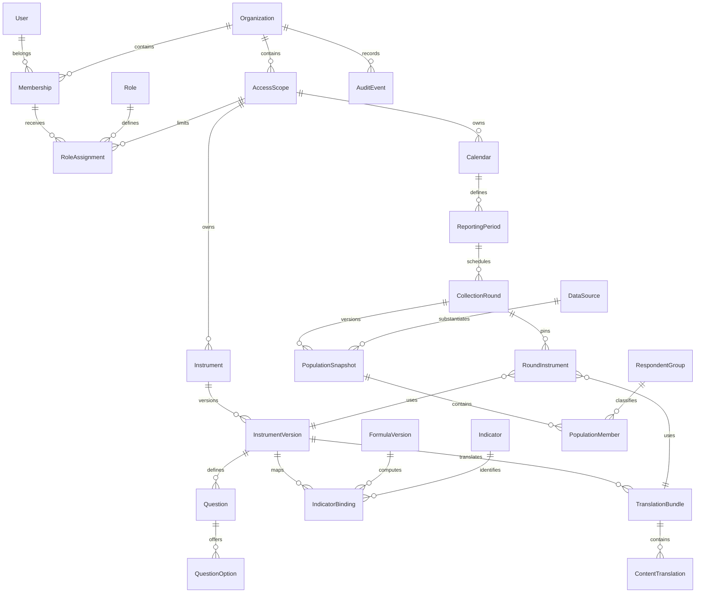

# M1 — โครงสร้างข้อมูล สิทธิ์ และประวัติรุ่น

เริ่มจาก `main` commit `e7386fbf1686779d05900c11b946f11559e498b5` ซึ่งรวม M0 ผ่าน PR #2 แล้ว
ใช้ Blueprint 1.2 และ Instruments 1.1 ใน `docs/source/` กับทะเบียน M0 ที่ตรวจจากต้นฉบับ
ไฟล์ต้นฉบับและทะเบียน M0 ไม่ถูกแก้ใน M1

## บัญชีเดิมและผลต่อ migrations

ก่อน M1 โครงการใช้ `django.contrib.auth.User` ตามค่าเริ่มต้น ไม่มี custom user model
และมีเฉพาะ migrations ของ Django (`auth`, `contenttypes`, `admin`, `sessions`)
จึงคง `auth.User` และ primary key เดิม ไม่เปลี่ยน `AUTH_USER_MODEL` หรือแก้ migrations ของ Django
รหัสผ่าน กลุ่ม สิทธิ์เดิม และตารางประวัติการ migrate ยังคงอยู่
ตารางธุรกิจใหม่ใช้ UUID และอ้างผู้ใช้เดิมด้วย foreign key

สิทธิ์ของ M1 เป็นสิทธิ์ตามองค์กร/ขอบเขตที่เพิ่มจาก Django auth ไม่ตีความ `is_staff`,
`is_superuser` หรือ Django Group เดิมว่าได้สิทธิ์ข้อมูลธุรกิจทุกขอบเขตโดยอัตโนมัติ
การตั้ง membership และ role grant ครั้งแรกต้องทำโดยผู้ดูแลที่ได้รับอนุญาตในสภาพแวดล้อมปลายทาง
migrations ไม่สร้างบัญชี บุคคล องค์กร ประชากร หรือ role grant สมมติ

## ตารางแต่ละกลุ่ม

ชื่อตารางจริงใช้ชื่อแอปนำหน้า เช่น `accounts_organization`, `catalog_instrumentversion`
คอลัมน์ `organization` ของข้อมูลรอบและ audit อ้างองค์กรโดยตรง;
ข้อมูลเครื่องมืออ้างองค์กรผ่าน `scope → organization` และ foreign key ที่ตรวจขอบเขต

| กลุ่ม / model | ใช้ทำอะไร |
|---|---|
| `accounts.Organization` | องค์กรและเขตเวลา |
| `accounts.AccessScope` | ขอบเขตข้อมูลแบบต้นไม้ภายในองค์กร เช่น หน่วยงาน/หลักสูตร ไม่อนุมานรายชื่อจริง |
| `accounts.Membership` | ผูกบัญชีเดิมกับองค์กร เปิด/เพิกถอนสถานะสมาชิก |
| `accounts.Role` | ชุดสิทธิ์จากรายการที่ระบบรองรับ |
| `accounts.RoleAssignment` | ให้ role แก่สมาชิกในขอบเขตและช่วงเวลา ระบุการครอบคลุมขอบเขตย่อยและเวลาที่เพิกถอน |
| `accounts.UserPreference` | ภาษาที่บัญชีเลือก `th/en`; การเลือกอังกฤษไม่ถือเป็นการรับรองคำแปล |
| `catalog.Instrument` | รหัสเครื่องมือ F01–F06 ภายในขอบเขต |
| `catalog.InstrumentVersion` | รุ่น สถานะ checksum วิธีประเมิน กลุ่ม workflow และรุ่นต้นทางที่นำมาทำฉบับใหม่ |
| `catalog.Question` | รหัสข้อคงที่ ข้อความไทย ชนิดคำตอบ เงื่อนไขบังคับ/แสดง กลุ่ม มาตรา และตำแหน่งต้นฉบับ |
| `catalog.QuestionOption` | รหัสตัวเลือก ข้อความ คะแนน และสถานะคำตอบ; NA ไม่มีคะแนนศูนย์แฝง |
| `catalog.InstrumentContent` | ชื่อ คำชี้แจง rubric และต้นฉบับประกอบ; raw source เก็บสำหรับตั้งค่า ไม่ส่งให้ผู้ตอบ |
| `catalog.FormulaVersion` | นิยามสูตร รุ่น พารามิเตอร์ และ hash; อนุญาตเฉพาะ formula key ที่ตรวจไว้ ไม่มีการประมวลผลข้อความด้วย eval |
| `catalog.Indicator` | รหัสตัวชี้วัด ชื่อ/สถานะชื่อ หน่วยและทิศทาง; ชื่อทางการที่ไม่มีแหล่งยังเป็น null ตาม M0 |
| `catalog.IndicatorBinding` | ผูกรุ่นเครื่องมือกับตัวชี้วัด สูตร กลุ่ม มิติ และ snapshot นิยามเดิม |
| `catalog.BindingQuestion` | ระบุคำถามต้นทางของแต่ละ binding โดยต้องอยู่ในเครื่องมือรุ่นเดียวกัน |
| `catalog.TranslationBundle` | รุ่นชุดคำแปลที่ผูกกับเครื่องมือรุ่นหนึ่ง และสถานะเผยแพร่ |
| `catalog.ContentTranslation` | ข้อความไทย/อังกฤษ รหัสเนื้อหาร่วมกัน hash ต้นฉบับ สถานะและผู้ตรวจรับ |
| `catalog.LocalizedLabel` | คู่ข้อความไทย/อังกฤษสำหรับชื่อกลุ่ม ตัวชี้วัด ปฏิทิน หน้าจอ และข้อความระบบ แยก namespace/key/รุ่น ขอบเขตและสถานะตรวจรับ |
| `rounds.Calendar` | ฐานปีงบประมาณ/การศึกษา/ปฏิทิน/กำหนดเอง พร้อมเขตเวลา |
| `rounds.ReportingPeriod` | ปีรายงาน พ.ศ.ตั้งแต่ 2565 วันเริ่มจริง วันสิ้นสุดแบบไม่รวมวันนั้น ลำดับปี/ช่วงย่อย รุ่น และผู้รับรอง |
| `rounds.CollectionRound` | รอบเก็บข้อมูล ผู้รับผิดชอบ เวลาเปิด/กำหนดส่ง/ปิด สถานะ คำชี้แจงความเป็นส่วนตัว และประชากรที่ตรึงใช้จริง |
| `rounds.RoundInstrument` | ตรึงรุ่นเครื่องมือและ bundle คำแปลในแต่ละบริบทของรอบ |
| `rounds.RespondentGroup` | รหัสกลุ่ม ชื่อ กลุ่มแม่ และสถานะใช้งานภายในขอบเขต |
| `rounds.PopulationSnapshot` | นิยามและหน่วยนับประชากร จำนวนตามกลุ่ม รุ่น วันจับข้อมูล วันตรึง และแหล่งที่มาข้อมูลประชากร |
| `rounds.PopulationMember` | หน่วยสิทธิ์และข้อเท็จจริงการทำงานที่จำเป็นต่อประชากร อยู่ในส่วนข้อมูลระบุตัวบุคคลที่จำกัดสิทธิ์ |
| `rounds.ResponsibilityAssignment` | ผู้รับผิดชอบหลัก/สำรองตามขอบเขตหรือรอบ พร้อมช่วงเวลาที่รับผิดชอบ |
| `rounds.DataSource` | ที่มาข้อมูลรายรายการ/ผลรวมเดิม ตำแหน่งอ้างอิง วิธีวัด/รุ่นเดิม checksum ข้อจำกัด และประวัติฉบับแก้ไข |
| `auditlog.AuditEvent` | ผู้กระทำ การกระทำ วัตถุ เหตุผล ขอบเขต และเวลา เป็นประวัติที่เพิ่มได้แต่แก้/ลบไม่ได้ |



## การตรวจสิทธิ์และรักษาประวัติ

บริการใน `apps/*/services.py` เป็นจุดเรียกใช้งานที่ตรวจสิทธิ์และบันทึก audit ใน transaction เดียวกัน
หน้าเว็บ/API ในระยะถัดไปต้องเรียกบริการเหล่านี้และ query ที่จำกัดขอบเขต
การเรียก ORM โดยตรงจากโค้ดที่เชื่อถือได้ไม่ได้ตรวจตัวตนของผู้ร้องขอแทน service
PostgreSQL constraints/triggers ป้องกันข้อมูลผิดความสัมพันธ์และการแก้ประวัติ แม้ข้าม model validation
แต่ไม่ได้เป็นระบบ RLS สำหรับแจก credentials ฐานข้อมูลให้ผู้ใช้ปลายทาง

- ตรวจสถานะผู้ใช้ สมาชิก ขอบเขต ช่วงเวลาของ grant และการเพิกถอนใหม่ทุกครั้ง
- ไม่ข้ามองค์กร/ขอบเขตโดยอัตโนมัติ การให้สิทธิ์ลงขอบเขตย่อยต้องเลือกอย่างชัดเจน
- `self.read/self.write` ต้องตรงเจ้าของบัญชี ไม่ใช่สิทธิ์ให้คะแนน F06 แทนผู้อื่น
- ผู้ให้ role ต่อไม่สามารถให้สิทธิ์ ขอบเขตย่อย หรืออายุ grant เกินสิทธิ์ของตน
- role ที่มีผู้รับแล้วและรายละเอียด grant เดิมแก้ไม่ได้ ต้องสร้าง role/grant ใหม่และเพิกถอนของเดิม
- audit ที่อ่านได้จำกัดขอบเขตตรงตามคำขอ ไม่รวมข้อมูลทุก scope ขององค์กร
- รุ่นเครื่องมือและเนื้อหาที่เผยแพร่แล้วแก้ไม่ได้ ต้อง clone รุ่นใหม่ซึ่งคำแปลต้องตรวจรับใหม่
- รุ่นสูตรที่ถูกใช้งานและ binding ที่เผยแพร่แล้วเก็บไว้; FK ใช้ `PROTECT` ป้องกันการลบประวัติที่อ้างอิง
- รอบใช้รุ่นเครื่องมือ/bundle ที่เผยแพร่แล้ว ปฏิทินที่รับรอง และประชากรที่ตรึงแล้ว
- ต้องระบุที่มาประชากรก่อนตรึง เป็นข้อมูลของผู้จัดการประชากร ไม่ใช่หลักฐานที่บังคับผู้ตอบ F06
- ช่วงวันที่จริงไม่ได้คำนวณจากเลขปีรายงานอย่างเดียว: ปีงบประมาณ 2565 สามารถเริ่ม 2021-10-01 ได้
- ที่มาข้อมูลแก้ผ่าน revision ใหม่; ถ้าไม่ทราบวิธีเดิมต้องบันทึกข้อจำกัด ไม่สร้างวิธีประเมินขึ้นแทน
- audit รับเฉพาะ metadata ที่อนุญาต ไม่รับ token หรือข้อความคำตอบ และไม่เก็บข้อมูลระบุตัวจากการแก้ประชากรเป็นค่า field

## ทะเบียน M0 ภาษา และ F06

`seed_catalog` เป็นคำสั่งนำเข้าที่ต้องระบุ scope และผู้กระทำที่มีสิทธิ์
ไม่ทำงานอัตโนมัติใน migration และไม่ถูกเรียกกับฐานจริงในงานนี้
ตัวนำเข้าตรวจ hash เอกสารต้นฉบับและรุ่น 1.2/1.1 อ่านทะเบียนที่ตรวจไว้
นำเข้าคำถาม 190 ข้อ ตัวชี้วัดฐาน 63 รหัส และสูตร 20 ชนิดเป็น draft
เรียกซ้ำกับข้อมูลเดียวกันไม่สร้างซ้ำหรือเขียนทับ draft ที่แก้ไว้
ข้อมูลต้นฉบับต่างจาก seed เดิมต้องสร้างรุ่นใหม่

การทดสอบเปรียบเทียบข้อความ/รหัสคำถาม ตัวเลือก คะแนน กลุ่ม เงื่อนไข สูตรและ binding กับ M0
ควบคู่กับชุดทดสอบ M0 ที่เทียบต้นฉบับ ไม่สรุปจากจำนวนรายการเพียงอย่างเดียว

คำแปลมี `draft`, `needs_review`, `approved`, `stale` และผู้ตรวจ/เวลาจริง
เมื่อแก้ต้นฉบับ hash จะไม่ตรงและสถานะรับรองถูกยกเลิก
ก่อนเผยแพร่ bundle ต้องมีไทยและอังกฤษที่ตรวจรับครบสำหรับเนื้อหาผู้ตอบทุกข้อ/ตัวเลือก/คำชี้แจง/rubric
ข้อมูลดิบใน source section ยังต้องคัดเป็นคำชี้แจงผู้ตอบก่อนเผยแพร่
การอ่านข้อความผู้ตอบไม่ fallback ไปหาภาษาที่ไม่มีการรับรอง

ชื่อกลุ่มจากทะเบียน 17 รหัสและชื่อแสดงผลตัวชี้วัด 63 รหัสถูกนำเข้าเป็น `LocalizedLabel`
รวม 80 คู่ข้อความที่ยังเป็น draft ภาษาอังกฤษที่ไม่มีไม่ได้แต่งขึ้นหรือเปิดใช้
ข้อความหน้าจอ/ปฏิทิน/ข้อความระบบมี namespace รองรับ ให้ผู้พัฒนาหน้าจอระยะถัดไปใส่ต้นฉบับจริง
ตรวจรับและเผยแพร่รุ่นก่อนเรียกบริการอ่านข้อความ ไม่มี fallback ไป draft

F06 ถูกจำกัดทั้ง model และ PostgreSQL ให้ใช้ `self_report`
ห้ามเปิด assessor scoring, required evidence หรือ workflow ตรวจคะแนนแทนเจ้าตัว
ยังไม่มีตารางคำตอบ F06 หรือระบบผู้ตรวจ F06 ใน M1
การประเมินคำตอบจริงและการเลือกรุ่น submitted ณ cutoff เป็นงานระยะถัดไป

## migrations และการทดสอบบน PostgreSQL ชั่วคราว

`apps/*/migrations/` เป็นแหล่งหลักในการสร้างตารางและติดตั้ง constraints/triggers
ไม่มีชุด SQL สำหรับ apply แยกนอก migration และไม่ใช้ Supabase SQL Editor สร้างตารางคู่ขนาน
การย้อน migration ที่ลบตารางไม่ใช่วิธีย้อนข้อมูลหลังเริ่มใช้งาน; การปรับรอบถัดไปให้เพิ่ม migration ใหม่

`edpex.testing` บังคับ PostgreSQL ที่ `127.0.0.1` และชื่อฐาน `edpex_m1_*`
ปฏิเสธ Supabase profile และค่า remote host ตั้งแต่โหลด settings
ค่าที่ใช้ในการทดสอบเป็นบัญชีของ cluster ชั่วคราว ไม่มี secrets ของ Supabase

ตัวอย่างสำหรับ cluster ชั่วคราวที่พอร์ต 55439:

```text
python manage.py check --settings=edpex.testing
python manage.py makemigrations --check --dry-run --settings=edpex.testing
python scripts/test_m1_migrations.py
python manage.py test --settings=edpex.testing --noinput
```

สคริปต์ migration สร้างฐานใหม่ด้วยชื่อสุ่มสองฐานทุกครั้ง:

1. ฐานว่าง: migrate ครบ สร้างบัญชีทดสอบ และตรวจว่าไม่มี migration ค้าง
2. ฐานเดิมจำลอง: migrate เฉพาะ Django contrib ก่อน เพิ่มบัญชี/กลุ่ม/สิทธิ์ทดสอบ
   แล้ว migrate M1 ตรวจว่า PK รหัสผ่าน การเข้าสู่ระบบ และความสัมพันธ์สิทธิ์เดิมยังคงครบ

สคริปต์ลบเฉพาะฐานชื่อสุ่มที่สร้างในการเรียกครั้งนั้น ไม่ reset ฐานเดิม
บน Windows sandbox ที่จำกัดการส่งสัญญาณระหว่าง PostgreSQL processes ใช้
`python scripts/test_m1_migrations.py --keep-databases` และ Django test `--keepdb`
พร้อม `EDPEX_TEST_DB_NAME=edpex_m1_<ชื่อใหม่>` เพื่อเก็บฐานทดสอบใน cluster ชั่วคราวจนปิด cluster
Linux CI ใช้ service PostgreSQL 17 ที่แยกจาก Supabase และล้างฐานชั่วคราวตามปกติ

### ผลที่รันจริง วันที่ 15 กันยายน 2569

- PostgreSQL 17.11 ชั่วคราวบน Windows พอร์ต loopback 55439; Django 5.2.17
- ชุดรวม 98 tests ผ่านใน 44.252 วินาที: M0/การตั้งค่าเดิม 29, accounts 28, audit 4, catalog 13, rounds 24
- เส้นทางฐานว่างและฐานเดิมจำลองผ่าน ตรวจ `auth.User` เดิมและไม่มี migration ค้าง
- `makemigrations --check --dry-run`: ไม่พบ model drift; Django system check: ไม่พบปัญหา
- compilation และ `git diff --check` ผ่าน
- ใช้ `--keepdb`/`--keep-databases` ในรอบสุดท้าย เพราะ sandbox Windows ไม่อนุญาตการส่งสัญญาณ checkpoint ตอนลบฐาน
  การลอง cleanup รอบแรกจึงไม่สำเร็จ แม้ assertions การ migrate ผ่านแล้ว; ไม่อ้างว่าทดสอบ cleanup สำเร็จใน Windows นี้
- ข้อมูลทดสอบเป็นข้อมูลสมมติใน cluster ชั่วคราวเท่านั้น ไม่มีการเชื่อม Supabase

## ความเชื่อมโยงกับ Blueprint และขอบเขตการส่งมอบ

| ข้อ Blueprint | สิ่งที่ M1 วางไว้ |
|---|---|
| 1–4, 9, 16 | บัญชีเดิม UUID ของข้อมูลธุรกิจ ขอบเขต role และ audit |
| 2, 6–7, 10–11, 25 | ทะเบียนคำถาม/ตัวเลือก/สูตร/63 รหัส การอ้างต้นฉบับและรุ่นที่แก้ย้อนหลังไม่ได้ |
| 8, 14 | แยก population identity จากนิยามแบบฟอร์ม ยังไม่สร้าง survey response linkage หรือระบบหลักฐาน |
| 24, 26, 30 | ปีรายงานตั้งแต่ 2565 ปฏิทินตามวันจริง รอบ ผู้รับผิดชอบ ประชากร และ provenance revisions |
| 31, 33 | schema สองภาษา สถานะตรวจรับ การตรึง bundle และทดสอบสิทธิ์/รุ่น |
| 5, 12–13, 15, 17–23, 27–29, 32 | คง traceability M0 เพื่อพัฒนาหน้าจอ สูตร/API/รายงาน/งานเบื้องหลังและตรวจรับในระยะถัดไป |

งานนี้ส่งโครงสร้างและบริการพื้นฐาน ไม่อ้างว่าหน้าจอตั้งค่า ฟอร์มตอบ calculation engine
Dashboard แจ้งเตือน การนำเข้าผลย้อนหลังจริง หรือ UAT ครบแล้ว
ไม่ได้เปลี่ยน connection checker หรือค่าการเชื่อม Supabase ไม่ apply migrations ไป Supabase และไม่ deploy
