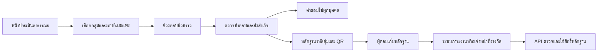

# NEXORA: ร่างออกแบบการเข้าประเมินสาธารณะ

สถานะ: ผู้ใช้ยืนยันข้อสงสัยแล้ว อยู่ระหว่างพัฒนาและทดสอบเส้นทางใหม่ในฐานทดสอบแยก
วันที่: 19 กันยายน 2569

## ข้อกำหนดที่ผู้ใช้ระบุชัดเจน

- หน้าเข้าประเมินสาธารณะ ไม่สมัครบัญชี ไม่ต้องแจกคำเชิญรายบุคคล
- ผู้ตอบเลือกกลุ่มของตนเอง และเห็นเฉพาะแบบ/คำถามที่ตรงกลุ่ม
- เจ้าหน้าที่ที่ได้รับมอบหมายเท่านั้นตั้งค่า เตรียมรอบ เปิดรับ และจัดการผล
- คงหลักฐานรหัสอ้างอิง/QR หลังส่งสำเร็จ รองรับการตรวจภาระงานและสิทธิ์รางวัลในอนาคต
- แยกการพิสูจน์การเข้าร่วมออกจากคำตอบ ป้องกันการนำคำตอบไปเชื่อมตัวบุคคล
- ม่วง/ชมพู/ทอง โลโก้/มาสคอตเดิม ไทย/อังกฤษ มือถือ และการโต้ตอบที่ใช้งานด้วยแป้นพิมพ์ได้
- ใส่คำอธิบายและตัวอย่างใกล้ช่องบันทึกของฟอร์มจัดการ ไม่ใช้ placeholder เป็นคำอธิบายเพียงอย่างเดียว
- คงกติกาเดิม: ตอบทุกข้อที่แสดง ยกเว้นส่วนข้อเสนอแนะที่ข้ามได้
- ผู้ใช้สั่งให้ถามทันทีเมื่อมีข้อสงสัย ห้ามตัดสินใจแทนในประเด็นที่ยังไม่ตรงกัน

## หลักฐานต้นทางที่อ่าน

ไฟล์ทั้งหมดอยู่ใน `C:/Users/User/Desktop/ปรับปรุงระบบ/` อ่านโดยไม่แก้ต้นฉบับ

| ไฟล์ | หน้า | SHA-256 |
|---|---:|---|
| ข้อกำหนดการปรับปรุงระบบ 2026-19-09.pdf | 2 | f31752c2f11efbf41367c5860c8ffc9b8b8ca65200142dc3e0418850389903c3 |
| ทะเบียนตัวย่อ.pdf | 1 | 3e3a784dc0e042f94161b538ecf80476283a0d6b0ed20e6eb034abdaaca8fe32 |
| สรุปตัวชี้วัดที่ต้องการเก็บจากการจัดทำแบบฟอร์ม แบบสอบถาม หรือแบบประเมิน.pdf | 13 | d40d019adc0b9418c7caf0df2c890dd10a8fdd5f5e8c0a11684d7488ecb4aee0 |

พบรหัสตัวชี้วัดหลักไม่ซ้ำ 63 รหัส เทียบกับ `catalog/indicators.json` หลังตัดส่วนมิติย่อยแล้ว
ไม่พบรหัสที่ขาดหรือเกิน การตรงกันของรหัสไม่ได้ยืนยันว่าชื่อ คำถาม สูตร และทุกมิติถูกต้องทั้งหมด
ยังต้องตรวจเส้นทางแต่ละกลุ่มเมื่อเชื่อมฟอร์มจริง โดยเฉพาะ F05/F06 ซึ่งโค้ดปัจจุบันใหม่กว่าคลัง M0

## ข้อยืนยันจากผู้ใช้ (19 กันยายน 2569)

1. ST2 คือบุคลากรสายสนับสนุน แก้ข้อความซ้ำในข้อกำหนด
2. กศ.ม. (สะเต็มศึกษา) ใช้ชื่อ “สาขาวิชาสะเต็มศึกษา”
3. ยังไม่เพิ่ม S2 และ SP1 ในหน้าสาธารณะนี้
4. ยอมรับหลักฐานแบบผู้ถือรหัส: พิสูจน์การส่งสำเร็จ ไม่ยืนยันตัวบุคคลหรือการตอบไม่ซ้ำข้ามอุปกรณ์
   ระบบภาระงาน/ผู้จัดรางวัลตรวจตัวบุคคลแยกภายหลัง ไม่เชื่อมกับคำตอบ
5. ออกหลักฐานแยกต่อแบบและการส่งสำเร็จ ไม่รอครบชุด
6. C2.2 ปริญญาเอกใช้ชั้นปี 1, 2, 3 และ 4 ขึ้นไป
7. F04 ให้บุคลากรประเมินผู้บริหารทุกคนทุกตำแหน่ง ไม่เลือกเฉพาะผู้เกี่ยวข้อง

พัฒนารุ่นการเข้าสาธารณะใหม่โดยไม่แปลงคำตอบ/รอบ/รหัสเดิม และไม่เปิดใช้ฐานจริงอัตโนมัติ

## ผังเลือกกลุ่มตามเอกสาร

ใช้ 6 หมวดใหญ่ตามข้อกำหนด ให้รหัสกลุ่มเป็นข้อมูลประกอบ ไม่ใช้รหัสเป็นชื่อปุ่มเพียงอย่างเดียว
ไม่แสดง M1/M2 เป็นกลุ่มผู้ตอบ เพราะเป็นการแบ่งส่วนตลาดในทะเบียนอ้างอิง

| หมวดหน้าแรก | กลุ่มปลายทางจากเอกสาร | แบบเดิมที่เกี่ยวข้อง |
|---|---|---|
| ผู้เรียน | C1, C2.1, C2.2, C3.1 | F01 |
| ผู้ให้ทุนวิจัย | C4.1 | F02 |
| ผู้รับบริการวิชาการ | C5.1, C5.2, C5.3 | F02 |
| ผู้มีส่วนได้ส่วนเสีย | S1, S3-1, S3-2 | F02 |
| คู่ความร่วมมือ | CO-1, CO-2, CO-3, CO-4 | F02 |
| บุคลากร | ST1 สายวิชาการ, ST2 สายสนับสนุน | F03, F04, F05, F06 |

รวม 17 กลุ่มปลายทางตามรายการใหม่ โดยยังไม่เพิ่มกลุ่มนอกเอกสารเอง

## เส้นทางหน้าจอที่เสนอ

1. **หน้าสาธารณะ**: โลโก้ ชื่อระบบ ชื่อวิทยาลัย ปุ่มภาษา หัวเรื่อง
   “ทุกประสบการณ์ของท่าน ช่วยให้เราพัฒนาได้ดีขึ้น” และ 6 การ์ดกลุ่ม
   แยกปุ่ม “สำหรับเจ้าหน้าที่” ขนาดรองออกจากปุ่มเริ่มประเมิน
2. **เลือกกลุ่มย่อยและบริบท**: แสดงเฉพาะตัวเลือกที่เกี่ยวข้อง มีคำอธิบาย เช่น CO-2 กับ CO-4
   เลือกหลักสูตร/ช่วงชั้นปีตามที่เจ้าหน้าที่กำหนดและตรงเอกสาร ไม่ให้ผู้ตอบสร้างหลักสูตรหรือรอบเอง
   ห้ามนำตัวเลือกหลักสูตรทุกระดับมาปนในรายการเดียว
3. **เลือกรอบ/กิจกรรมที่เปิดอยู่**: หากมีหนึ่งรายการตรงบริบท แสดงสรุปพร้อมปุ่มเริ่ม
   หากมีหลายรายการ แสดงชื่อ ช่วงเวลา ปี และคำอธิบายที่แยกกันได้
   ไม่เดาเลือกรอบล่าสุดให้อัตโนมัติ ไม่เปิดเผยร่าง/รอบภายในที่ยังไม่เผยแพร่
4. **ก่อนตอบ**: แสดงกลุ่ม บริบท แบบประเมิน ปี และคำชี้แจงข้อมูลที่กระชับ
   ให้ย้อนแก้กลุ่มก่อนเริ่มได้ เมื่อเริ่มแล้วเซิร์ฟเวอร์ตรึงบริบท ไม่เชื่อค่ากลุ่มจากฟอร์มที่แก้เอง
5. **ตอบและทบทวน**: ใช้ส่วนที่อนุมัติแล้วต่อ เพิ่มความชัดเจนว่ากำลังตอบเรื่องใด
   แจ้งข้อบังคับที่ขาดและพาไปตำแหน่งนั้น เก็บค่าที่กรอกเมื่อสลับภาษา
6. **ส่งสำเร็จ**: ออกหลักฐานหลังฐานข้อมูลบันทึกสำเร็จเท่านั้น มีคัดลอก/ดาวน์โหลด QR และคำอธิบายการใช้
   หากเครือข่ายขาดระหว่างส่ง ต้องตรวจสถานะ/ลองคำสั่งเดิมอย่างปลอดภัย ไม่ออกคำตอบหรือหลักฐานซ้ำ

บนมือถือใช้ลำดับขั้นสั้น 4 ขั้น “เลือกกลุ่ม / เลือกแบบ / ตอบและทบทวน / เก็บหลักฐาน”
แสดงรายละเอียดรองด้วย disclosure ปุ่มสัมผัสใหญ่ มี focus ที่เห็นชัด ใช้ไอคอนร่วมกับข้อความ
ไม่สื่อสถานะด้วยสีเพียงอย่างเดียว และเคารพ reduced motion

## การแยกคำตอบและหลักฐานที่เสนอ



เส้นจากการส่งสำเร็จไปสองชุดข้อมูลหมายถึงความสำเร็จในธุรกรรมเดียวกัน ไม่ใช่ foreign key เชื่อมกัน
หลักฐานไม่มี response ID คะแนน รายการคำตอบ รหัสนิสิต ชื่อ หรืออีเมล
ใช้รหัสสุ่มคาดเดายาก เก็บ hash ฝั่งเซิร์ฟเวอร์ คงการแยก test/live และสิทธิ์ผู้ตรวจเป็นรายวัตถุประสงค์
QR ไม่ใส่ข้อมูลส่วนตัวหรือ secret ใน URL query ที่อาจเข้าบันทึกเว็บ

ระบบปลายทางเป็นผู้ยืนยันตัวบุคคลและตัดสินชั่วโมง/กิจกรรมหรือรางวัล ไม่ส่งชื่อกลับมาจับคู่กับคำตอบ
การตรวจรหัสและการใช้สิทธิ์ต้องแยกกัน: สแกนดูสถานะไม่เผาสิทธิ์ ใช้สิทธิ์ต้องผ่านผู้ตรวจที่ได้รับอนุญาต
ต้องกัน double redemption และรองรับ idempotency กรณีคำขอซ้ำ

หลักฐานแบบผู้ถือรหัสถูกส่งต่อหรือคัดลอกได้ จึงไม่อ้างว่าเป็นหลักฐานยืนยันตัวบุคคล
ผู้ใช้ยอมรับขอบเขตนี้แล้ว ต้องอธิบายตรงกันทั้งหน้าผู้ตอบ ผู้จัดการรอบ และผู้ตรวจหลักฐาน

## ผลกระทบต่อข้อมูลและการคำนวณ

- การเปิดสาธารณะทำให้จำนวนชุดคำตอบไม่เท่ากับจำนวนคนที่ยืนยันแล้ว
- การใช้ cookie หรือ session ช่วยเตือนตอบซ้ำบนอุปกรณ์เดิม แต่ไม่ใช่หลักประกันหนึ่งคนหนึ่งครั้ง
- ไม่ใช้ IP หรือ browser fingerprint เป็นรหัสประจำผู้ตอบ
- จำนวนผู้มีสิทธิ์ที่เจ้าหน้าที่ระบุยังเป็นข้อมูลอ้างอิง ห้ามใช้แทนจำนวนผู้ตอบไม่ซ้ำโดยไม่มีหลักฐาน
- ไม่ตัดหรือ clamp ร้อยละเพื่อซ่อนปัญหาคำตอบเกินตัวหาร ต้องแสดงความผิดปกติและให้ผู้รับผิดชอบพิจารณา
- รอบเดิมและผลที่รับรองแล้วต้องคงแหล่งข้อมูล วิธีรับคำตอบและรุ่นนิยามเดิม
- รอบสาธารณะใหม่ต้องระบุวิธีรับข้อมูลและข้อจำกัดของจำนวนผู้ตอบในรายงาน/การส่งออกด้วย

## ผลกระทบที่พบในโค้ด

| ส่วนปัจจุบัน | สิ่งที่ต้องออกแบบ/ปรับ |
|---|---|
| participation/admission.py | ปัจจุบันต้อง mint NXA1 เป็นชุดและจำกัด F01 C1; ทางเข้าสาธารณะต้องเป็นกลไกใหม่ ไม่แจก token รายบุคคลใน UI |
| participation/models.py และ migrations | แยกการเผยแพร่แบบสาธารณะ/ช่วงตอบชั่วคราวจากสิทธิ์เชิญเดิม และตรวจข้อบังคับฐานข้อมูลด้วย |
| participation/services.py | นโยบายหลักฐานยังไม่รองรับ F05/F06; ต้องรองรับอย่างชัดเจนและทดสอบก่อนเปิดทุกแบบ |
| surveys/models.py | ชั้นปี C1 เดิมมีชุดตัวเลือกจำกัด ไม่ตรง “ปี 6 ขึ้นไป” ในเอกสารใหม่; ต้องสร้างรุ่นข้อมูลใหม่ ไม่เปลี่ยนความหมาย option เดิมย้อนหลัง |
| surveys/schema.py, validation.py | ตรวจกลุ่ม/บริบท/คำถามฝั่งเซิร์ฟเวอร์ให้ตรงรุ่นที่เผยแพร่ และใช้รายการที่เลือกได้ตามเงื่อนไข |
| leadership/services.py | F04 ปัจจุบันสร้างรอบจากรายชื่อผู้เกี่ยวข้อง; ต้องคงทะเบียนผู้ถูกประเมิน แต่แยกวิธีเข้าแบบสาธารณะออกจากทะเบียนผู้ตอบ |
| participation/setup.py และ operator | เปลี่ยนงานหลักเป็นจัดการการเผยแพร่/รอบ/หลักฐาน เพิ่มคำอธิบายทุกฟิลด์ที่เกี่ยวข้อง |
| accounts/workflow.py, home, sidebar, wayfinding | เปลี่ยนเมนูหลักให้สอดคล้องทางเข้าสาธารณะ คงทางเข้ารหัสเก่าเฉพาะรอบเดิม |
| results, calculation, reports/export | แสดงวิธีรับข้อมูล ขอบเขตตัวหาร การตอบซ้ำ และการปกปิดกลุ่มขนาดเล็ก |

## รูปแบบคำอธิบายในหน้าจัดการ

ทุกช่องควรมีชื่อที่สื่อความหมาย สถานะจำเป็น/ไม่บังคับ เหตุผลที่ต้องกรอก ตัวอย่าง และข้อผิดพลาดใกล้ช่อง
ข้อความยาวใช้ “ดูตัวอย่าง/เหตุผล” ที่พับขยายได้ มี aria-describedby เชื่อมฟิลด์กับคำอธิบาย
ตัวอย่างเป็นข้อมูลสมมุติและไม่บันทึกแทนผู้ใช้โดยอัตโนมัติ

| ช่อง | คำอธิบาย/ตัวอย่างที่เสนอ |
|---|---|
| ชื่อรอบสาธารณะ | ผู้ตอบเห็นชื่อนี้ ควรแยกปีและกิจกรรม เช่น “ประสบการณ์ผู้เรียน ปีการศึกษา 2569” |
| กลุ่มและหลักสูตร | กำหนดว่าใครจะเห็นแบบ ไม่ใช่รายชื่อผู้ตอบ เลือกจากทะเบียนที่ได้รับอนุมัติ |
| ปีและประเภทปี | ระบุปีที่นำผลไปรายงาน เลือกปีการศึกษาหรือปีงบประมาณให้ตรงแบบ |
| จำนวนผู้มีสิทธิ์/แหล่งอ้างอิง | จำนวนรวมและที่มาของตัวหาร ไม่ต้องแนบรายชื่อ ไม่ใช่จำนวนคนตอบที่ระบบยืนยันตัวตนแล้ว |
| เปิดรับ/กำหนดส่ง/ปิดรับ | อธิบายความต่าง แสดงเขตเวลาไทย และตรวจลำดับวันก่อนบันทึก |
| การเผยแพร่สาธารณะ | แสดงตัวอย่างสิ่งที่ผู้ตอบจะเห็น แยกจากเพียงการตั้งสถานะรอบเป็นเปิด |
| ชื่อกิจกรรมบนหลักฐาน | ใช้ระบุสิ่งที่ทำเสร็จ ไม่ใส่ชื่อบุคคลหรือคะแนน เช่น “ร่วมประเมินประสบการณ์บุคลากร ปี 2569” |
| ภาระงาน/รางวัล | กำหนดวัตถุประสงค์การสอบทวน ไม่ใช่การให้ชั่วโมงหรือรางวัลอัตโนมัติ |
| อายุหลักฐาน | วันสุดท้ายที่ระบบปลายทางตรวจใช้ได้ แสดงผลกระทบเมื่อหมดอายุ |

## การลดข้อมูลส่วนบุคคล

ใช้หลักเก็บเท่าที่จำเป็นและคำชี้แจงที่ตรงพฤติกรรมจริง ไม่อ้างว่าไม่เก็บข้อมูลส่วนบุคคลเพียงเพราะไม่มีชื่อ
การผสมกลุ่ม หลักสูตร ชั้นปี หรือข้อความอิสระอาจระบุตัวทางอ้อมได้ ต้องจำกัดการเปิดเผยกลุ่มย่อย
แยกข้อมูลบุคคลในระบบภาระงาน/รางวัลออกจากผลประเมิน และคง HTTPS/CSRF/สิทธิ์/บันทึกการจัดการ
ต้องระบุผู้ควบคุมข้อมูล วัตถุประสงค์ ระยะเวลาเก็บ และช่องทางติดต่อจริงก่อนเผยแพร่
นี่เป็นแนวทางออกแบบ ไม่ใช่การรับรองความสอดคล้อง PDPA ทั้งระบบ

อ้างอิงหลักการ: พ.ร.บ.คุ้มครองข้อมูลส่วนบุคคล พ.ศ. 2562 มาตรา 6, 22 และ 23
จาก [ฉบับเผยแพร่โดยกองกฎหมาย กรมประชาสัมพันธ์](https://law.prd.go.th/th/file/get/file/20231122b19b536a4647f29a6d99e228909779b4120136.PDF)

## เกณฑ์ตรวจหลังได้คำตอบและลงมือพัฒนา

- ไม่ต้องล็อกอินหรือใช้รหัสคำเชิญเพื่อเลือกแบบสาธารณะ; ผู้ตอบเข้าหน้าจัดการไม่ได้
- แสดงครบเฉพาะกลุ่มและรอบที่เจ้าหน้าที่เผยแพร่ ไม่แสดงกลุ่ม/หลักสูตรผิดเงื่อนไข
- ใช้กลุ่มที่เซิร์ฟเวอร์ตรวจแล้ว ไม่ยอมรับการเปลี่ยน group/binding ใน POST
- ส่งไม่ครบแล้วไม่บันทึก; ส่งซ้ำ/ขาดเครือข่ายไม่สร้างคำตอบหรือหลักฐานเพิ่ม
- ไม่ออก QR ก่อน commit; ล้มเหลวแล้ว rollback ทั้งคำตอบและหลักฐาน
- รหัสตรวจแล้วไม่เปิดเผยคำตอบ; ใช้สิทธิ์ซ้ำและใช้ข้ามขอบเขตไม่ได้
- F01–F06 และ F04 หลายผู้ถูกประเมินทดสอบตามนโยบายที่ผู้ใช้ยืนยัน
- ไทย/อังกฤษ/มือถือ/แป้นพิมพ์ และการสลับภาษาไม่ทำข้อมูลที่กรอกหาย
- รหัสและผลเก่ายังทำงาน ไม่แก้ฐานใช้งานจริงหรือข้อมูลรอบเดิมโดยอัตโนมัติ

## ผลพัฒนารุ่นทดสอบ 19 กันยายน 2569

เพิ่มหน้า `/survey/public/` แยกจากพื้นที่เจ้าหน้าที่ โดยมี 6 หมวด 17 กลุ่มตามข้อกำหนดที่ยืนยันแล้ว
ผู้ตอบเลือกกลุ่ม หลักสูตร และชั้นปีที่เกี่ยวข้อง แล้วเห็นเฉพาะรอบที่เปิดและเผยแพร่ตรงบริบท
ไม่สร้างบัญชี รายชื่อผู้ตอบ หรือคำเชิญสำหรับรอบสาธารณะใหม่ ใช้ cookie ช่วงตอบชั่วคราว
ไม่เก็บคำตอบที่ยังไม่ส่งลง browser storage; F01 เก็บเฉพาะรหัสกู้สถานะในแท็บตามกลไกเดิม
หลัง commit ล้าง secret/ชั้นปี/เวลาของช่องสิทธิ์ที่ใช้แล้ว และเก็บหลักฐานแยกจากคำตอบ
ช่องที่ยังไม่ส่งและหมดอายุถูกล้างเมื่อเข้าหน้าสาธารณะ/เริ่มตอบ/เรียก cleanup เดิม

- F01 C1 คงแบบหน้าจอที่ผู้ใช้อนุมัติ พร้อมเส้นทางตอบ ทบทวน ตรวจครบ และดาวน์โหลด QR
- F01 กลุ่มอื่นและ F02–F06 ใช้แบบฟอร์มแบ่งหมวดร่วมกับคำถาม/คำแปลที่ผ่านการตรวจแล้ว
- ข้ามได้เฉพาะข้อเสนอแนะ คำถามตามเงื่อนไขตรวจเฉพาะเมื่อแสดง
- F04 สร้างแยกรอบต่อผู้บริหารทุกคนทุกตำแหน่งในทะเบียนปีและกลุ่มบุคลากรเดียวกัน
  ต้องเตรียมและเปิดครบชุดก่อนแสดงให้ตอบ มีทางตรึงทะเบียนสำหรับบุคลากรทุกคนโดยไม่ใช้รายชื่อผู้ตอบ
  ตัวเลือกไม่มีข้อมูลเพียงพอยังเป็นคำตอบที่ถูกต้อง ไม่แปลงเป็นคะแนนบวก
- เจ้าหน้าที่มีหน้าสร้างรอบสาธารณะพร้อมคำอธิบายและตัวอย่าง หน้าทบทวน และหน้าควบคุมเปิด/เผยแพร่/พัก/ปิด
- F04 การควบคุมหน้าสาธารณะใช้กับทั้งชุดในปี/กลุ่มนั้น; ทางจัดการรอบเก่าไม่เป็นช่องเปลี่ยนสถานะซ้ำซ้อน
- ผลคำนวณ/CSV บันทึกว่าเป็น public self-selection และไม่ใช่จำนวนผู้ตอบที่ยืนยันว่าเป็นคนไม่ซ้ำ
  สูตรเดิมและการปกปิดกลุ่มขนาดเล็กยังใช้ตามรุ่นที่ตรึงไว้ ไม่ตีความ option ชั้นปีเดิมใหม่

### ทดลองในเครื่องนี้

เปิด `http://127.0.0.1:8768/survey/public/` แล้วเลือก **ผู้เรียน → นิสิตปริญญาตรี → การประถมศึกษา → ชั้นปี → ดูแบบประเมิน**
รอบตัวอย่าง `PUBLIC-PREVIEW-F01-PRIMARY` เป็นข้อมูลสมมุติ 20 หน่วย เปิดไว้เฉพาะฐานพรีวิวแยก
binding `e884fe1c-0b2c-4b6e-a300-dc8e3037f731` ไม่มีรายชื่อผู้ตอบ ไม่มีคำเชิญ
กลุ่มอื่นยังไม่มีรอบเผยแพร่ในฐานพรีวิว จึงแสดงสถานะไม่มีแบบเปิดรับ ไม่ใช่ข้อผิดพลาด
หน้าสำหรับเจ้าหน้าที่อยู่ `/workspace/` ของพอร์ต 8768; สิทธิ์ใช้บัญชีที่มีสิทธิ์อยู่ในสำเนาเดิม ไม่เพิ่มสิทธิ์ edpexadmin

ฐานใหม่ `edpex_m1_public_ui` ที่ PostgreSQL loopback 55469 สร้างจาก snapshot ฐาน demo เดิม
แล้ว apply migrations ใหม่เฉพาะฐานใหม่นี้และฐานทดสอบอัตโนมัติ ใช้ `edpex.public_demo`
เซิร์ฟเวอร์และข้อมูลเดิมพอร์ต 8767 รวมถึงฐานใช้งานจริงไม่ได้ migrate/reset หรือเปลี่ยนรอบ
สคริปต์ `scripts/prepare_public_preview.py` มี guard ฐาน/setting และสร้างตัวอย่างได้เพียงครั้งเดียว

### หลักฐานตรวจสอบ

รวม **17 กรณีทดสอบใหม่ผ่าน** จากหลายรอบ ไม่ใช่ผล 17 กรณีในการรันเดียว:

- `public-assessments-final-tests.log`: 15 กรณี ผ่าน 14; อีกกรณีส่งสำเร็จ HTTP 201 แต่ test คาด 200
- แก้ expectation ตาม API แล้ว `public-assessments-http-tests.log`: ผ่าน 2 กรณี
  ครอบคลุมกรณี HTTP F01 เดิม และกรณีใหม่ F02/F03 ผ่านหน้า form-submit ถึงหลักฐานจริงในฐานทดสอบ
- `public-review-taxonomy-tests.log`: ผ่าน 3 กรณี (2 taxonomy เดิม + 1 review ใหม่)
- `public-js-tests.log`: 12 กรณีเดิมของ validation/transport ผ่าน รวมกรณีส่งซ้ำ สถานะไม่แน่ชัด และไม่ส่งบริบทที่ตรึงแล้ว
- Django check และ migration drift check ผ่าน; template ทั้ง 102 ไฟล์ compile ผ่าน
- Browser: หน้าเลือกกลุ่ม → F01, ภาษาอังกฤษคงกลุ่ม/หลักสูตร/ชั้นปี, mobile 390 และ desktop 1280 ไม่มี overflow
  โลโก้ มาสคอต และโทนม่วง/ชมพู/ทองแสดงได้ ไม่มี console error ในเส้นทางที่ตรวจ

Log อยู่ใน `../../outputs` จากโฟลเดอร์ repository นี้ รัน DB tests ด้วย `edpex.testing` และฐาน `test_edpex_m1_f01_ui` เท่านั้น

### สิ่งที่ยังต้องเตรียมก่อนรับข้อมูลจริง

รุ่นนี้เป็นการพัฒนาและทดสอบ **ยังไม่เปิดใช้งานจริง** หน้าเตรียมรอบยอมรับต้นแบบ synthetic ที่เผยแพร่และตรวจคำแปลแล้วเท่านั้น
ก่อน rollout ต้องเลือก/อนุมัติฉบับคำถามและคำแปลจริงของแต่ละแบบ เตรียมทะเบียนผู้บริหารครบปี
ระบุคำชี้แจงผู้ควบคุมข้อมูล/ระยะเวลาเก็บ/ช่องทางติดต่อจริง และทดสอบ migration กับ backup ใน staging
ต้องกำหนด HTTPS และนโยบาย log/backup/retention ของระบบติดตั้งจริงด้วย เพราะข้อมูลเวลาหรือข้อความอิสระยังอาจระบุตัวทางอ้อมได้
ยังไม่เชื่อมระบบภาระงานจริงหรือจับรางวัล ผู้ตรวจที่ได้รับสิทธิ์เป็นผู้ตรวจบุคคลแยกจากคำตอบในภายหลัง
การทดสอบครั้งนี้ไม่ใช่การรับรอง PDPA หรือรับประกันว่าไม่มีข้อผิดพลาดในทุกสภาพแวดล้อม

## ทดลองหน้าสาธารณะจากเครื่องในเครือข่าย (19 กันยายน 2569)

- URL: http://10.51.72.64:8768/survey/public/
- เครื่องแม่ข่าย: Wi-Fi 10.51.72.64/21; วงทดสอบ 10.51.72.0/21
- ใช้ edpex.public_demo_lan และฐานสมมุติ edpex_m1_public_ui เดิม ไม่ migrate/seed/reset
- ช่องนี้เปิดเฉพาะ public directory, form, proof/status/QR/download และ static
  ปิด login/workspace/admin/verifier APIs; ระบบจริงยังต้องใช้ HTTPS
- HTTP ยอมรับเฉพาะ setting นี้ + ชื่อฐาน/พอร์ต/host ที่กำหนด + IP ลูกข่ายในวงที่กำหนด
  ไม่มีการปลอม request ว่าเป็น HTTPS; ไม่เชื่อ X-Forwarded-For และไม่อนุญาต live/real policy
- ทดสอบ guard 4 กรณีผ่าน: outputs/public-lan-tests.log
- ตรวจผ่าน IP จากเครื่องแม่ข่าย: หน้า public200, CSS200, choices200 พบ1รอบ; login/workspace/redeem404
- ยังไม่ได้ทดสอบจากเครื่องอื่นจริง Windows firewall ON/BlockInbound
  พยายามเพิ่มกฎ TCP8768 เฉพาะ local10.51.72.64 remote10.51.72.0/21 แต่ได้ Access denied
  ไม่มีการเพิ่มกฎสำเร็จ ผู้ใช้ต้องเปิด PowerShell แบบ Run as administrator แล้วรัน:

```powershell
New-NetFirewallRule -Name 'NEXORA-Synthetic-Public-8768' -DisplayName 'NEXORA synthetic public preview (LAN 8768)' -Direction Inbound -Action Allow -Protocol TCP -LocalPort 8768 -LocalAddress 10.51.72.64 -RemoteAddress 10.51.72.0/21 -Profile Any
```

ถ้าเพิ่มกฎแล้วแต่เครื่องอื่นยังเข้าไม่ได้ ให้ตรวจว่าอยู่ในวงเดียวกันและเครือข่ายไม่เปิด client isolation
IP อาจเปลี่ยนเมื่อเชื่อมเครือข่ายใหม่; ต้องตรวจแล้วปรับ listener/กฎให้ตรง ไม่เปิดพอร์ตกว้างแทน
